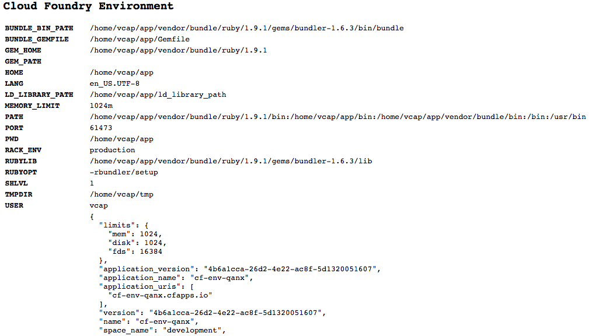

# CLI Basics and Pushing Your First App

It is extremely important to be well versed with the Cloud Foundry CLI tools since almost all functionality is provided through the CLI - the web interface is primarily used for billing and includes only rudimentary management functions beyond that.

To get started, check the version of your CLI tools and view the help output:

```
$ cf -v
cf version 6.6.2-0c953cf-2014-10-17T18:10:36+00:00

$ cf -h
NAME:
   cf - A command line tool to interact with Cloud Foundry

USAGE:
   [environment variables] cf [global options] command [arguments...] [command options]

VERSION:
   6.6.2-0c953cf-2014-10-17T18:10:36+00:00

BUILD TIME:
   2014-10-29 13:22:53.764357487 -0400 EDT

GETTING STARTED:
   login, l                                      Log user in
   logout, lo                                    Log user out
   passwd, pw                                    Change user password
   target, t                                     Set or view the targeted org or space

   api                                           Set or view target api url
   auth                                          Authenticate user non-interactively

APPS:
   apps, a                                       List all apps in the target space
   app                                           Display health and status for app

   push, p                                       Push a new app or sync changes to an existing app
   scale                                         Change or view the instance count, disk space limit, and memory limit for an app
   delete, d                                     Delete an app
   rename                                        Rename an app

   start, st                                     Start an app
   stop, sp                                      Stop an app
   restart, rs                                   Restart an app
   restage, rg                                   Restage an app

   events                                        Show recent app events
   files, f                                      Print out a list of files in a directory or the contents of a specific file
   logs                                          Tail or show recent logs for an app

   env, e                                        Show all env variables for an app
   set-env, se                                   Set an env variable for an app
   unset-env                                     Remove an env variable

   stacks                                        List all stacks (a stack is a pre-built file system, including an operating system, that can run apps)

SERVICES:
   marketplace, m                                List available offerings in the marketplace
   services, s                                   List all service instances in the target space
   service                                       Show service instance info

   create-service, cs                            Create a service instance
   delete-service, ds                            Delete a service instance
   rename-service                                Rename a service instance

   bind-service, bs                              Bind a service instance to an app
   unbind-service, us                            Unbind a service instance from an app

   create-user-provided-service, cups            Make a user-provided service instance available to cf apps
   update-user-provided-service, uups            Update user-provided service instance name value pairs

ORGS:
   orgs, o                                       List all orgs
   org                                           Show org info

   create-org, co                                Create an org
   delete-org                                    Delete an org
   rename-org                                    Rename an org

SPACES:
   spaces                                        List all spaces in an org
   space                                         Show space info

   create-space                                  Create a space
   delete-space                                  Delete a space
   rename-space                                  Rename a space

DOMAINS:
   domains                                       List domains in the target org
   create-domain                                 Create a domain in an org for later use
   delete-domain                                 Delete a domain
   create-shared-domain                          Create a domain that can be used by all orgs (admin-only)
   delete-shared-domain                          Delete a shared domain

ROUTES:
   routes, r                                     List all routes in the current space
   create-route                                  Create a url route in a space for later use
   map-route                                     Add a url route to an app
   unmap-route                                   Remove a url route from an app
   delete-route                                  Delete a route
   delete-orphaned-routes                        Delete all orphaned routes (e.g.: those that are not mapped to an app)

BUILDPACKS:
   buildpacks                                    List all buildpacks
   create-buildpack                              Create a buildpack
   update-buildpack                              Update a buildpack
   rename-buildpack                              Rename a buildpack
   delete-buildpack                              Delete a buildpack

USER ADMIN:
   create-user                                   Create a new user
   delete-user                                   Delete a user

   org-users                                     Show org users by role
   set-org-role                                  Assign an org role to a user
   unset-org-role                                Remove an org role from a user

   space-users                                   Show space users by role
   set-space-role                                Assign a space role to a user
   unset-space-role                              Remove a space role from a user

ORG ADMIN:
   quotas                                        List available usage quotas
   quota                                         Show quota info
   set-quota                                     Assign a quota to an org

   create-quota                                  Define a new resource quota
   delete-quota                                  Delete a quota
   update-quota                                  Update an existing resource quota

SPACE ADMIN:
   space-quota                                   Show space quota info
   space-quotas                                  List available space resource quotas
   create-space-quota                            Define a new space resource quota
   update-space-quota                            update an existing space quota
   delete-space-quota                            Delete a space quota definition and unassign the space quota from all spaces
   set-space-quota                               Assign a space quota definition to a space
   unset-space-quota                             Unassign a quota from a space

SERVICE ADMIN:
   service-auth-tokens                           List service auth tokens
   create-service-auth-token                     Create a service auth token
   update-service-auth-token                     Update a service auth token
   delete-service-auth-token                     Delete a service auth token

   service-brokers                               List service brokers
   create-service-broker                         Create a service broker
   update-service-broker                         Update a service broker
   delete-service-broker                         Delete a service broker
   rename-service-broker                         Rename a service broker

   migrate-service-instances                     Migrate service instances from one service plan to another
   purge-service-offering                        Recursively remove a service and child objects from Cloud Foundry database without making requests to a service broker

   service-access                                List service access settings
   enable-service-access                         Enable access to a service or service plan for one or all orgs
   disable-service-access                        Disable access to a service or service plan for one or all orgs

SECURITY GROUP:
   security-group                                Show a single security group
   security-groups                               List all security groups
   create-security-group                         Create a security group
   update-security-group                         Update a security group
   delete-security-group                         Deletes a security group
   bind-security-group                           Bind a security group to a space
   unbind-security-group                         Unbind a security group from a space

   bind-staging-security-group                   Bind a security group to the list of security groups to be used for staging applications
   staging-security-groups                       List security groups in the staging set for applications
   unbind-staging-security-group                 Unbind a security group from the set of security groups for staging applications

   bind-running-security-group                   Bind a security group to the list of security groups to be used for running applications
   running-security-groups                       List security groups in the set of security groups for running applications
   unbind-running-security-group                 Unbind a security group from the set of security groups for running applications

ENVIRONMENT VARIABLE GROUPS:
   running-environment-variable-group, revg      Retrieve the contents of the running environment variable group
   staging-environment-variable-group, sevg      Retrieve the contents of the staging environment variable group
   set-staging-environment-variable-group, ssevg Pass parameters as JSON to create a staging environment variable group
   set-running-environment-variable-group, srevg Pass parameters as JSON to create a running environment variable group

FEATURE FLAGS:
   feature-flags                                 Retrieve list of feature flags with status of each flag-able feature
   feature-flag                                  Retrieve an individual feature flag with status
   enable-feature-flag                           Enable the use of a feature so that users have access to and can use the feature.
   disable-feature-flag                          Disable the use of a feature so that users have access to and can use the feature.

ADVANCED:
   curl                                          Executes a raw request, content-type set to application/json by default
   config                                        write default values to the config

PLUGIN:
   plugins                                       list all available plugin commands
   install-plugin                                Install the plugin defined in command argument
   uninstall-plugin                              Uninstall the plugin defined in command argument

INSTALLED PLUGINS:

ENVIRONMENT VARIABLES
   CF_COLOR=false                     Do not colorize output
   CF_HOME=path/to/dir/               Override path to default config directory
   CF_STAGING_TIMEOUT=15              Max wait time for buildpack staging, in minutes
   CF_STARTUP_TIMEOUT=5               Max wait time for app instance startup, in minutes
   CF_TRACE=true                      Print API request diagnostics to stdout
   CF_TRACE=path/to/trace.log         Append API request diagnostics to a log file
   HTTP_PROXY=proxy.example.com:8080  Enable HTTP proxying for API requests

GLOBAL OPTIONS
   --version, -v                      Print the version
   --help, -h                         Show help
```

As you can see, there are a LOT of commands available in the CLI tools. We will be making our way through these commands as we proceed through the book!

## First things first: target your CF instance

In order execute commands against your instance of CF, you must first specify the credentials. You actually receive a little guidance for how to do this on the  [Tools](https://console.run.pivotal.io/tools) page:

```
$ cf login -a https://api.run.pivotal.io
  API endpoint: https://api.run.pivotal.io
  Username> your_username
  Password> your_password
  Org> your_org
  Space> your_space
```

The `-a` flag specifies the API endpoint that you are logging into. You can also target the API endpoint using the `cf api` command:

```
$ cf api https://api.run.pivotal.io
Setting api endpoint to https://api.run.pivotal.io...
OK

API endpoint: https://api.run.pivotal.io (API version: 2.16.0)
Not logged in. Use 'cf login' to log in.
```

Since we aren't logged in yet, we are prompted to log in after the end point is set.

The command to log in is `cf login`. If you supply `cf login` with no parameters, you will be prompted to log into the instance of Cloud Foundry that you just targeted:

```
$ cf login
API endpoint: https://api.run.pivotal.io

Email> your_email

Password> your_password
Authenticating...
OK

Targeted org quinn

Targeted space development


API endpoint: https://api.run.pivotal.io (API version: 2.16.0)
User:         your_email
Org:          quinn
Space:        development
```

Since I only have one org and one space they are targeted automatically. If I had multiple orgs and/or spaces, I would be prompted to select the appropriate org and space.

You can also choose to log in using the `-a`, `-u`, and `-p` flags, which allow you to specify the API endpoint, username, and password respectively in one command:

```
$ cf login -a https://api.run.pivotal.io -u your_username -p your_password
API endpoint: https://api.run.pivotal.io
Authenticating...
OK

Targeted org quinn

Targeted space development


API endpoint: https://api.run.pivotal.io (API version: 2.16.0)
User:         your_username
Org:          quinn
Space:        development
```

Just like before, you can see that the API endpoint has been targeted and the org and space have been selected.

If you are using an AWS instance and TryCF, you can log in and target your instance using the same method - just remember to specify `--skip-ssl-validation` as indicated in your confirmation email:

```
$ cf login -a https://api.<IP address>.xip.io -u admin -p admin --skip-ssl-validation
```

A word of **caution** for logging in with the `-p` option: since this exposes the password, this may be best left for when the account you are using doesn't have security concerns.

## Pushing your first application

Since we will be creating and deleting several applications in Cloud Foundry, I recommend creating a new directory for these applications. e.g.:

```bash
$ mkdir CFApps

$ cd !$
```

For our first app we are going to use a simple Ruby app, called cf-env, that prints the environment information. You can obtain this application by cloning its GitHub repository:

```bash
$ git clone https://github.com/cloudfoundry-community/cf-env.git
Cloning into 'cf-env'...
remote: Counting objects: 71, done.
remote: Total 71 (delta 0), reused 0 (delta 0)
Unpacking objects: 100% (71/71), done.
Checking connectivity... done.
```

When you enter the `cf-env` directory you may receive an ignorable message about how the appropriate version of Ruby was selected:

```bash
$ cd cf-env
RVM used your Gemfile for selecting Ruby, it is all fine - Heroku does that too,
you can ignore these warnings with 'rvm rvmrc warning ignore /path/CFApps/cf-env/Gemfile'.
To ignore the warning for all files run 'rvm rvmrc warning ignore allGemfiles'.
```

For our first application push we will not be modifying the applicaton at all - so we can go ahead and push. To push an application, you will use the `cf push` command. We can view the full usage of `cf push` by viewing its help output:

```bash
$ cf push -h
NAME:
   push - Push a new app or sync changes to an existing app

ALIAS:
   p

USAGE:
   Push a single app (with or without a manifest):
   cf push APP [-b BUILDPACK_NAME] [-c COMMAND] [-d DOMAIN] [-f MANIFEST_PATH]
   [-i NUM_INSTANCES] [-k DISK] [-m MEMORY] [-n HOST] [-p PATH] [-s STACK] [-t TIMEOUT]
   [--no-hostname] [--no-manifest] [--no-route] [--no-start]

   Push multiple apps with a manifest:
   cf push [-f MANIFEST_PATH]


OPTIONS:
   -b 			Custom buildpack by name (e.g. my-buildpack) or GIT URL (e.g. https://github.com/heroku/heroku-buildpack-play.git)
   -c 			Startup command, set to null to reset to default start command
   -d 			Domain (e.g. example.com)
   -f 			Path to manifest
   -i 			Number of instances
   -k 			Disk limit (e.g. 256M, 1024M, 1G)
   -m 			Memory limit (e.g. 256M, 1024M, 1G)
   -n 			Hostname (e.g. my-subdomain)
   -p 			Path of app directory or zip file
   -s 			Stack to use (a stack is a pre-built file system, including an operating system, that can run apps)
   -t 			Start timeout in seconds
   --no-hostname	Map the root domain to this app
   --no-manifest	Ignore manifest file
   --no-route		Do not map a route to this app
   --no-start		Do not start an app after pushing
   --random-route	Create a random route for this app
```

Please note: All commands have help output, so if you wanted to view the help output for any cf command, you would use `cf <command name> -h`.

In this case, the application doesn't require us to specify anything other than the application name. When choosing an application name, please keep in mind:

1. The application name by default is used to create the application's URI of the form appName.cfapps.io - so choose an application name that makes an appropriate subdomain.
1. PWS supplies the cfapps.io domain to all users you will want to choose an application name that is unqiue or else you will receive an error message. One way to do this is by appending your own name or local login to the application name `cf-env`, e.g. `cf-env-$(whoami)`.

In this case I will be leaving all the defaults in place, so to push the application I only need to enter the command and the application name:

```bash
$ cf push cf-env-$(whoami)
Creating app cf-env-qanx in org quinn / space development as qanx@starkandwayne.com...
OK

Creating route cf-env-qanx.cfapps.io...
OK

Binding cf-env-qanx.cfapps.io to cf-env-qanx...
OK

Uploading cf-env-qanx...
Uploading app files from: /path/CFApps/cf-env
Uploading 61.6K, 8 files
OK

Starting app cf-env-qanx in org quinn / space development as qanx@starkandwayne.com...
OK
-----> Downloaded app package (56K)
-------> Buildpack version 1.1.2
-----> Compiling Ruby/Rack
-----> Using Ruby version: ruby-1.9.3
-----> Installing dependencies using 1.6.3
       Running: bundle install --without development:test --path vendor/bundle --binstubs vendor/bundle/bin -j4 --deployment
       Fetching gem metadata from https://rubygems.org/..........
       Installing tilt 1.4.1
       Using bundler 1.6.3
       Installing rack 1.5.2
       Installing json_pure 1.8.1
       Installing rack-protection 1.5.2
       Installing sinatra 1.4.4
       Your bundle is complete!
       Gems in the groups development and test were not installed.
       It was installed into ./vendor/bundle
       Cleaning up the bundler cache.
###### WARNING:

1 of 1 instances running

App started

Showing health and status for app cf-env-qanx in org quinn / space development as qanx@starkandwayne.com...
OK

requested state: started
instances: 1/1
usage: 1G x 1 instances
urls: cf-env-qanx.cfapps.io

     state     since                    cpu    memory        disk
#0   running   2014-10-25 07:38:49 PM   0.0%   31.4M of 1G   42.4M of 1G
```

Once the application has been pushed, you can view it at the URL specifed at the bottom of the output. The application should look similar to:



Congrats on pushing your first app!

---

#### What to do if your route is not unique

If you choose an application name that results in a route that is not unique, you will receive an error message similar in the output to the following:
```
Creating route yourAppName.cfapps.io...
FAILED
Server error, status code: 400, error code: 210003, message: The host is taken: yourAppName
```
We will touch more on the what and why in a later chapter, but for now please simply do the following if you encounter this issue:
1. Delete the "proto-app" instance by entering `cf delete yourAppName`
1. Try pushing the application again with a new name, e.g. `cf push yourNewAppName`.

#### What to do if your application fails to start

You may see several messages `0 of 1 instances started` or similar before the application fails to start. With this particular application, the most common cause is that the application timed out for some reason. In this case you can simply push the application again without any changes.

---

#### CF CLI Commands

A quick review of the commands covered in this section:

| Command | Usage |
|----------|--------|
| `cf -h`, `cf -help` | Lists CF CLI commands and environmental variables as well as their purpose |
| `cf <command name> -h` | Provides help output for a specific command |
| `cf -v`, `cf -version` | Provides the current version of the CF CLI tool |
| `cf api` | Set or view target API |
| `cf login`, `cf l` | Log into targeted API. `-a` option can also be used to target the API before logging in. |
| `cf push`, `cf p` | Pushes an application to Cloud Foundry. |
| `cf delete`, `cf d` | Deletes an application. |
