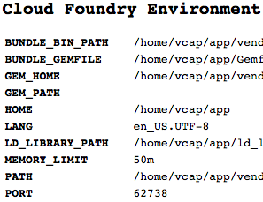
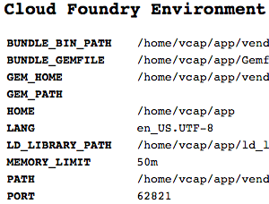
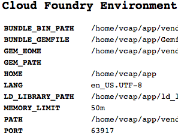
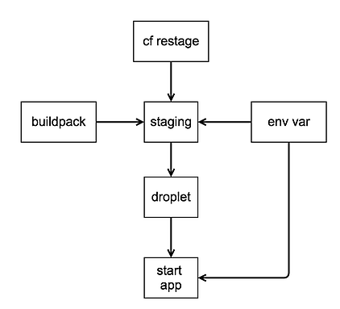
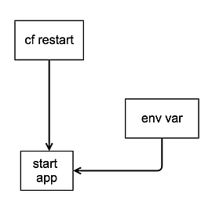
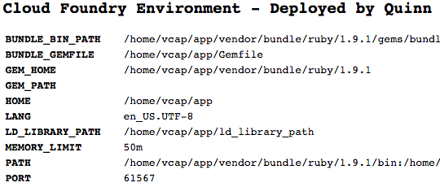

# Ch-ch-changes: Scaling, Manifests, and Updating your Application

## Scaling

From our above output we can see that the applictaion is not using all the resources that have been allocated to it. This is expected - it makes sense that the defaults would be high to help ensure that most applications will start by default. Now that we can see how the resources are used, we can trim the application down a little bit by using `cf scale`.

For some guidance, let's see what parameters we can control to scale the application:

```
$ cf scale -h
NAME:
   scale - Change or view the instance count, disk space limit, and memory limit for an app

USAGE:
   cf scale APP [-i INSTANCES] [-k DISK] [-m MEMORY] [-f]

OPTIONS:
   -i 	Number of instances
   -k 	Disk limit (e.g. 256M, 1024M, 1G)
   -m 	Memory limit (e.g. 256M, 1024M, 1G)
   -f	Force restart of app without prompt
```

It looks like we can specify the number of instances, memory, and disk. There is also a `-f` option that allows the command to restart the application, as needed, without prompting us for confirmation.

To start, let's scale down our application to 50 MB of disk and memory:

```
$ cf scale cf-env-qanx -m 50M -k 50M

This will cause the app to restart. Are you sure you want to scale cf-env-qanx?> y

Scaling app cf-env-qanx in org quinn / space development as qanx@starkandwayne.com...
OK
Stopping app cf-env-qanx in org quinn / space development as qanx@starkandwayne.com...
OK

Starting app cf-env-qanx in org quinn / space development as qanx@starkandwayne.com...
OK

0 of 1 instances running, 1 starting
1 of 1 instances running

App started

Showing health and status for app cf-env-qanx in org quinn / space development as qanx@starkandwayne.com...
OK

requested state: started
instances: 1/1
usage: 50M x 1 instances
urls: cf-env-qanx.cfapps.io

     state     since                    cpu    memory         disk
#0   running   2014-10-26 02:45:00 PM   0.0%   32.3M of 50M   42.4M of 50M
```

Since we scaled back the disk and memory, the application needed to restart. If we wanted to skip the "Are you sure you want to scale" prompt, we could have used the `-f` flag.

Let's say that we need this application to be available to many users despite traffic or any issues that an individual instance of the applictaion may have. In this case, we'll want to scale out the number of instances:

```
$ cf scale cf-env-qanx -i 10
Scaling app cf-env-qanx in org quinn / space development as qanx@starkandwayne.com...
OK
```

When we change the number of application instances what we are really doing is telling Cloud Foundry to create (or destroy) warden containers that are housing an application. Since this doesn't require restarting the application, we do not receive a prompt to verify that we want to restart. As we can view the progress of the 9 new application instances starting up by viewing the status of the applications:

```
$ cf apps
Getting apps in org quinn / space development as qanx@starkandwayne.com...
OK

name          requested state   instances   memory   disk   urls
cf-env-qanx   started           6/10        50M      50M    cf-env-qanx.cfapps.io
```

To see the different ports being used with your application, go to the URI specfied and keep an eye on the PORT field:

<table>
  <tr>
    <td></td>
    <td></td>
    <td></td<
  </tr>
</table>

As you refresh the page you should see the same number of different ports as there are application instances. Cloud Foundry's *router* takes care of load balancing the traffic accross all the application instances.

## Manifests

By default, the `cf push` command always looks for a `manifest.yml` file in the current working directory. The purpose of the manifest file is to specify the application parameters, for example how many instances should be running as well as how much memory and disk should be allocated. If there is no manifest specified or found, then the application is deployed using either the default values or using the values provided to `cf push`.

As indicated, preferably the manifest file is in the directory you are pushing your application code from. If it is not for some reason, or if it is not named `manifest.yml`, then you will need to use the `-f` flag to tell `cf push` where the manifest file is.

#### Exercise: Push with a manifest

Let's try deploying our `cf-env-$(whomai)` application using a manifest file. To keep with convention, we'll create a `manifest.yml` file in our application's parent directory:

```
$ vi manifest
```

The manifest file allows you to specify any parameter that you can pass to `cf push`, with the obvious exception being the path to the manifest itself. So let's get started with 5 instances, each with 50M of memory and 50M of disk.

```
# Getting started with manifests
applications:
- name: cf-env-qanx
  memory: 50M
  disk: 50M
  instances: 5
```

Notice that since this is a YAML file we cannot name our file using the shell command `whoami` - we have to explicitly state the name of our application. (For more information about YAML syntax, please refer to the Appendix.)

For practice, let's delete our existing application and then push it from scratch again:

```
$ cf d cf-env-$(whoami)

Really delete the app cf-env-qanx?> y
Deleting app cf-env-qanx in org quinn / space development as qanx@starkandwayne.com...
OK

$ cf push
Using manifest file /Users/qanx/Development/Books/AppsForBook/cf-env/manifest.yml

Creating app cf-env-qanx in org quinn / space development as qanx@starkandwayne.com...
OK

Using route cf-env-qanx.cfapps.io
Binding cf-env-qanx.cfapps.io to cf-env-qanx...
OK

Uploading cf-env-qanx...
Uploading app files from: /Users/qanx/Development/Books/AppsForBook/cf-env
Uploading 61.6K, 8 files
OK

Starting app cf-env-qanx in org quinn / space development as qanx@starkandwayne.com...
OK
-----> Downloaded app package (56K)
-------> Buildpack version 1.1.2
-----> Compiling Ruby/Rack
-----> Using Ruby version: ruby-1.9.3
-----> Installing dependencies using 1.6.3
       Running: bundle install --without development:test --path vendor/bundle --binstubs vendor/bundle/bin -j4 --deployment
       Fetching gem metadata from https://rubygems.org/..........
       Installing tilt 1.4.1
       Using bundler 1.6.3
       Installing json_pure 1.8.1
       Installing rack 1.5.2
       Installing rack-protection 1.5.2
       Installing sinatra 1.4.4
       Your bundle is complete!
       Gems in the groups development and test were not installed.
       It was installed into ./vendor/bundle
       Bundle completed (7.63s)
       Cleaning up the bundler cache.
###### WARNING:
       No Procfile detected, using the default web server (webrick)
       https://devcenter.heroku.com/articles/ruby-default-web-server
-----> Uploading droplet (12M)

1 of 5 instances running, 4 down

App started

Showing health and status for app cf-env-qanx in org quinn / space development as qanx@starkandwayne.com...
OK

requested state: started
instances: 2/5
usage: 50M x 5 instances
urls: cf-env-qanx.cfapps.io

     state     since                    cpu    memory         disk
#0   down      2014-10-30 03:31:25 PM   0.0%   0 of 0         0 of 0
#1   down      2014-10-30 03:31:25 PM   0.0%   0 of 0         0 of 0
#2   down      2014-10-30 03:31:25 PM   0.0%   0 of 0         0 of 0
#3   down      2014-10-30 03:31:25 PM   0.0%   0 of 0         0 of 0
#4   running   2014-10-30 03:31:17 PM   0.0%   32.5M of 50M   42.4M of 1G
```

Since one or more instances are running, the output for the `cf push` command terminates. We can use `cf apps` or `cf app <app name>` to see when all application instances are running:

```
$ cf apps
Getting apps in org quinn / space development as qanx@starkandwayne.com...
OK

name          requested state   instances   memory   disk   urls
cf-env-qanx   started           2/5         50M      1G     cf-env-qanx.cfapps.io
```

Although we may have missed it in the `cf push` output, the `cf apps` output has made it incredibly clear that something isn't right with our deployment. Specifically: each instance of our application is using the default 1 GB of disk instead of the 50 MB we specified.  So, what happened?

#### What went wrong?

At the time of this writing, how to specify the disk quota was not explicitly stated in the [manifest documentation](http://docs.cloudfoundry.org/devguide/deploy-apps/manifest.html), so we took a guess and assumed that `disk` would be appropriate. Unfortunately, this was an incorrect guess and `disk` is an unrecognized key, so the default 1 GB was used.

Although the documentation has since been updated, it is important to know how to go "splunking" and find solutions that you encounter when using Cloud Foundry. In this case, to find the answer (and subsequently update the documentation) I decided to try and take a look at the code related to `cf push` in Cloud Foundry's GitHub repositories:

1. Go to [github.com/cloudfoundry](https://github.com/cloudfoundry/)
2. Search for `cli`
3. Select the `cli` repository
4. Search the repository for `push`

A quick glance of the results shows that there is a lot more going on with `cf push` than just the manifests, so I tried searching for `manifest` instead.

While looking through the manifest results, you'll see some test files and some sample/default manifest files. GitHub shows the language of each file in the upper right of the result display. If you take a quick look through the YAML results, you'll see some sample YAML files with parameters we haven't covered yet, but unfortunately none of them are a "complete" manifest file in the sense that they do not have all possible parameters specified.

In order to take a look at all the possible parameters, we'll want to take a look at the code that is actually parsing the YAML files. Although originally written in Ruby, Cloud Foundry is slowly being written/re-written in Go. In this case, we'll want to start looking through the Go files to see which is responsible for reading in the manifest file.

Sticking with the first page of results, we can see the `manifest_test.go` file, which following Go convention will test `manifest.go`. We can take a look in either file to see what parameters `cf push` is expecting in the manifest.

Let's look at `manifest.go` first. If we focus on lines [136-150](https://github.com/cloudfoundry/cli/blob/ba10448e47646908b1a941dca224c2a9797778f8/cf/manifest/manifest.go#L136-L150) we can see what keys the YAML inputs are looking for when the code is reading the data from the manifest file:

```go
	appParams.BuildpackUrl = stringValOrDefault(yamlMap, "buildpack", &errs)
	appParams.DiskQuota = bytesVal(yamlMap, "disk_quota", &errs)
	appParams.Domain = stringVal(yamlMap, "domain", &errs)
	appParams.Host = stringVal(yamlMap, "host", &errs)
	appParams.Name = stringVal(yamlMap, "name", &errs)
	appParams.Path = stringVal(yamlMap, "path", &errs)
	appParams.StackName = stringVal(yamlMap, "stack", &errs)
	appParams.Command = stringValOrDefault(yamlMap, "command", &errs)
	appParams.Memory = bytesVal(yamlMap, "memory", &errs)
	appParams.InstanceCount = intVal(yamlMap, "instances", &errs)
	appParams.HealthCheckTimeout = intVal(yamlMap, "timeout", &errs)
	appParams.NoRoute = boolVal(yamlMap, "no-route", &errs)
	appParams.UseRandomHostname = boolVal(yamlMap, "random-route", &errs)
	appParams.ServicesToBind = sliceOrEmptyVal(yamlMap, "services", &errs)
	appParams.EnvironmentVars = envVarOrEmptyMap(yamlMap, &errs)
```

We can also take a look at the `manifest_test.go` file we found initially. Specifically, we can take a look at lines [162-211](https://github.com/cloudfoundry/cli/blob/ba10448e47646908b1a941dca224c2a9797778f8/cf/manifest/manifest_test.go#L162-L211). Here, we can see the interface laid out on lines 166-178 and we can also see what the test looks like on lines 198-208:

```go
map[interface{}]interface{}{
					"buildpack":    "my-buildpack",
					"disk_quota":   "512M",
					"domain":       "my-domain",
					"host":         "my-hostname",
					"name":         "my-app-name",
					"stack":        "my-stack",
					"memory":       "256M",
					"instances":    1,
					"timeout":      11,
					"no-route":     true,
					"random-route": true,
				},
```

Together, these two files have shown us all the possible parameters that we can use in our manifest file and given us some example inputs.

#### Exercise: Fix your disk_quota

Now that we know to use `disk_quota` to specify the disk allottment, let's try editing our `manifest.yml` file and pushing our application again.

Your `manifest.yml` should now be similar to:

```
# Getting started with manifests
applications:
- name: cf-env-qanx
  memory: 50M
  disk_quota: 50M
  instances: 1
```

Once your application starts, you should now see the correct disk allotment:

```
$ cf push
Using manifest file /Users/qanx/Development/Books/AppsForBook/cf-env/manifest.yml

Updating app cf-env-qanx in org quinn / space development as qanx@starkandwayne.com...
OK

Uploading cf-env-qanx...
Uploading app files from: /Users/qanx/Development/Books/AppsForBook/cf-env
Uploading 61.6K, 8 files
OK

Stopping app cf-env-qanx in org quinn / space development as qanx@starkandwayne.com...
OK

Starting app cf-env-qanx in org quinn / space development as qanx@starkandwayne.com...
OK
-----> Downloaded app package (56K)
-----> Downloaded app buildpack cache (1.7M)
-------> Buildpack version 1.1.2
-----> Compiling Ruby/Rack
-----> Using Ruby version: ruby-1.9.3
-----> Installing dependencies using 1.6.3
       Running: bundle install --without development:test --path vendor/bundle --binstubs vendor/bundle/bin -j4 --deployment
       Using rack 1.5.2
       Using tilt 1.4.1
       Using json_pure 1.8.1
       Using bundler 1.6.3
       Using rack-protection 1.5.2
       Using sinatra 1.4.4
       Your bundle is complete!
       Gems in the groups development and test were not installed.
       It was installed into ./vendor/bundle
       Bundle completed (0.37s)
       Cleaning up the bundler cache.
###### WARNING:
       No Procfile detected, using the default web server (webrick)
       https://devcenter.heroku.com/articles/ruby-default-web-server
-----> Uploading droplet (12M)

0 of 5 instances running, 2 starting, 3 down
2 of 5 instances running, 3 down

App started

Showing health and status for app cf-env-qanx in org quinn / space development as qanx@starkandwayne.com...
OK

requested state: started
instances: 2/5
usage: 50M x 5 instances
urls: cf-env-qanx.cfapps.io

     state     since                    cpu    memory         disk
#0   down      2014-10-30 03:58:09 PM   0.0%   0 of 0         0 of 0
#1   running   2014-10-30 03:57:52 PM   0.0%   29.5M of 50M   42.4M of 50M
#2   down      2014-10-30 03:58:09 PM   0.0%   0 of 0         0 of 0
#3   down      2014-10-30 03:58:09 PM   0.0%   0 of 0         0 of 0
#4   running   2014-10-30 03:57:54 PM   0.0%   29.4M of 50M   42.4M of 50M
```

#### Exercise: Change your host name

##### Method 1: Use a Host Name

Before moving on to our next topic, let's try changing our host name. Recalling our options in the manifest file, we can do this using `host`:

```
# Getting started with manifests
applications:
- name: cf-env-qanx
  memory: 50M
  disk_quota: 50M
  instances: 5
  host: flying
```

In this case I have chosen the name "flying", but you can choose any name you wish. When we push our application again, we will see a new URI has been provided:

```
$ cf push
Using manifest file /Users/qanx/Development/Books/AppsForBook/cf-env/manifest.yml

Updating app cf-env-qanx in org quinn / space development as qanx@starkandwayne.com...
OK

Using route flying.cfapps.io
Binding flying.cfapps.io to cf-env-qanx...
OK

Uploading cf-env-qanx...
Uploading app files from: /Users/qanx/Development/Books/AppsForBook/cf-env
Uploading 61.6K, 8 files
OK

Stopping app cf-env-qanx in org quinn / space development as qanx@starkandwayne.com...
OK

Starting app cf-env-qanx in org quinn / space development as qanx@starkandwayne.com...
OK
-----> Downloaded app package (56K)
-----> Downloaded app buildpack cache (1.7M)
-------> Buildpack version 1.1.2
-----> Compiling Ruby/Rack
-----> Using Ruby version: ruby-1.9.3
-----> Installing dependencies using 1.6.3
       Running: bundle install --without development:test --path vendor/bundle --binstubs vendor/bundle/bin -j4 --deployment
       Using json_pure 1.8.1
       Using rack 1.5.2
       Using bundler 1.6.3
       Using rack-protection 1.5.2
       Using tilt 1.4.1
       Using sinatra 1.4.4
       Your bundle is complete!
       Gems in the groups development and test were not installed.
       It was installed into ./vendor/bundle
       Bundle completed (0.38s)
       Cleaning up the bundler cache.
###### WARNING:
       No Procfile detected, using the default web server (webrick)
       https://devcenter.heroku.com/articles/ruby-default-web-server
-----> Uploading droplet (12M)

1 of 5 instances running, 1 starting, 3 down

App started

Showing health and status for app cf-env-qanx in org quinn / space development as qanx@starkandwayne.com...
OK

requested state: started
instances: 2/5
usage: 50M x 5 instances
urls: cf-env-qanx.cfapps.io, flying.cfapps.io

     state     since                    cpu    memory         disk
#0   running   2014-10-30 04:01:42 PM   0.0%   30.5M of 50M   42.4M of 50M
#1   down      2014-10-30 04:01:50 PM   0.0%   0 of 0         0 of 0
#2   down      2014-10-30 04:01:50 PM   0.0%   0 of 0         0 of 0
#3   running   2014-10-30 04:01:44 PM   0.0%   28.7M of 50M   42.4M of 50M
#4   down      2014-10-30 04:01:50 PM   0.0%   0 of 0         0 of 0
```

Since we did not delete our application prior to pushing it again, Cloud Foundry kept `cf-env-qanx.cfapps.io` and added `flying.cfapps.io`.

**Check it out:** What happens if you delete the application first and push it with the manifest file as it appears now?

##### Method 2: Use a Random Route

Let's say that we know we're pushing our application for testing purposes, so we want a unique route generated but we don't want to explicitly specify a host. This would be a great use case for `random-route`.

To use `random-route` delete the `host` line in your manifest file and add `random-route: true`. We are going to push our application from scratch again, so we're going to first delete the application and then delete the orphaned routes.

What's an orphaned route you ask? When you delete an application the route(s) associated with it are still available, they just are no longer bound to that application. A route that doesn't have a "parent application" is called an "orphaned route".

```
$ cf d cf-env-qanx

Really delete the app cf-env-qanx?> y
Deleting app cf-env-qanx in org quinn / space development as qanx@starkandwayne.com...
OK

$ cf routes
Getting routes as qanx@starkandwayne.com ...

host                               domain      apps
cf-env-qanx                        cfapps.io
flying                             cfapps.io

$ cf delete-orphaned-routes

Really delete orphaned routes?>> y
Getting routes as qanx@starkandwayne.com ...

Deleting route cf-env-qanx.cfapps.io...
Deleting route flying.cfapps.io...
OK
```

Now that everything is cleaned up, we can push our application:

```
$ cf p
Using manifest file /Users/qanx/Development/Books/AppsForBook/cf-env/manifest.yml

Updating app cf-env-qanx in org quinn / space development as qanx@starkandwayne.com...
OK

Uploading cf-env-qanx...
Uploading app files from: /Users/qanx/Development/Books/AppsForBook/cf-env
Uploading 61.6K, 8 files
OK

Stopping app cf-env-qanx in org quinn / space development as qanx@starkandwayne.com...
OK

Starting app cf-env-qanx in org quinn / space development as qanx@starkandwayne.com...
OK
-----> Downloaded app package (56K)
-----> Downloaded app buildpack cache (1.7M)
-------> Buildpack version 1.1.2
-----> Compiling Ruby/Rack
-----> Using Ruby version: ruby-1.9.3
-----> Installing dependencies using 1.6.3
       Running: bundle install --without development:test --path vendor/bundle --binstubs vendor/bundle/bin -j4 --deployment
       Using rack 1.5.2
       Using json_pure 1.8.1
       Using tilt 1.4.1
       Using bundler 1.6.3
       Using rack-protection 1.5.2
       Using sinatra 1.4.4
       Your bundle is complete!
       Gems in the groups development and test were not installed.
       It was installed into ./vendor/bundle
       Bundle completed (0.40s)
       Cleaning up the bundler cache.
###### WARNING:
       No Procfile detected, using the default web server (webrick)
       https://devcenter.heroku.com/articles/ruby-default-web-server

-----> Uploading droplet (12M)

1 of 5 instances running, 4 down

App started

Showing health and status for app cf-env-qanx in org quinn / space development as qanx@starkandwayne.com...
OK

requested state: started
instances: 1/5
usage: 50M x 5 instances
urls: cf-env-qanx-creative-rin.cfapps.io

     state     since                    cpu    memory         disk
#0   down      2014-10-30 04:38:17 PM   0.0%   0 of 0         0 of 0
#1   down      2014-10-30 04:38:17 PM   0.0%   0 of 0         0 of 0
#2   running   2014-10-30 04:38:07 PM   0.0%   31.6M of 50M   42.4M of 50M
#3   down      2014-10-30 04:38:17 PM   0.0%   0 of 0         0 of 0
#4   down      2014-10-30 04:38:17 PM   0.0%   0 of 0         0 of 0
```

**Check it out:** What happens if you...
1. ...don't delete the existing application and orphaned routes before pushing with `random-route` enabled?
2. ...leave a `host` specified when you enable `random-route`?


## What do I do? Push, restage, or restart?

When you make changes to an application, it may not be immediately obvious whether you should push, restage, or restart. If you are unsure, it is always best to push the application again as that not only pushes the application code and (un)binds the services, but also puts the application through staging again and starts the application.

Although pushing the application is the safest bet, you may not want to just keep pushing your application - especially if this process is time consuming. In that case, it is best to keep in mind what happens at each step of the process to determine the best course of action:

<table>
  <tr>
    <td></td>
    <td></td>
    <td></td>
  </tr>
  <tr>
    <td>`cf push`</td>
    <td>`cf restage`</td>
    <td>`cf restart`</td>
  </tr>
  <tr>
    <td><ul><li>Changes to application code</li>
        <li>Binding/unbinding services</li></ul></td>
    <td>Changes to environmental variables that are needed by the buildpack</td>
    <td>Changes to environmental variables that are **not** needed by the buildpack</td>
  </tr>
</table>

All that said, if you wanted to keep a quick rule in mind: Push changes to code or services, restage all other changes.

### Exercise: Change the application code and deploy

Just to see how a quick code change goes, let's change the title of the web page that our application generates. To do this, we will modify the text on line 7 of the `env.rb` file in the `cf-env` directory:

```ruby
require 'rubygems'
require 'sinatra'
require 'json/pure'

get '/' do
  res = "<html><body style=\"margin:0px auto; width:80%; font-family:monospace\">"
  res << "<head><title>Cloud Foundry Environment</title><meta name=\"viewport\" content=\"width=device-width\"></head>"
  res << "<h2>Cloud Foundry Environment - Deployed by Quinn</h2>"
  res << "<div><table>"
  ENV.keys.sort.each do |key|
    value = begin
                "<pre>" + JSON.pretty_generate(JSON.parse(ENV[key])) + "</pre>"
            rescue
                ENV[key]
            end
    res << "<tr><td><strong>#{key}</strong></td><td>#{value}</tr>"
  end
  res << "</table></div>"
  res << "<h2>HTTP Request Headers</h2>"
  res << "<div><table>"
  env.inject({}){|acc, (k,v)| acc[$1.downcase] = v if k =~ /^http_(.*)/i; acc}.sort.each do |k,v|
    res << "<tr><td><strong>#{k}</strong></td><td>#{v}</tr>"
  end
  res << "</table></div></body></html>"
end
```

In my case I just appended ` - Deployed by Quinn`, but you can modify the title however you like. Once you have modified your title, push your application and open it up in a browser:



**Check it out:** What happens if...
* ... you restage your application after changing code?
* ... you restart your application after changing code?

### Exercise: Change and environmental variable and deploy

{{{ Try to change a variable that is required by the buildpack? }}}

**Check it out:** What happens if...
* ... you push your application after changing the environmental variable?
* ... you restart your application after changing the environmental variable?

#### CF CLI Commands

A quick review of the commands covered in this section:

| Command | Usage |
|----------|--------|
| `cf scale` | Used to scale an application by increasing (or decreasing) the number of instances, amount of memory, or amount of disk. |
| `cf restage`, `cf rg` | Restage an application |
| `cf restart`, `cf rs` | Restart an application |
| `cf stop`, `cf sp` | Stop an application |
| `cf routes` | View routes |


# Add PWS GUI

To pull in material from the previous chapter, how do you...

* ...stop an app in the PWS GUI?
* ...start an app in the PWS GUI?
* ...scale an app in the PWS GUI?
* ...delete an app in the PWS GUI?

# To add

resource: http://blog.pivotal.io/cloud-foundry-pivotal/products/simplified-application-deployment-with-cloud-foundry-manifest

