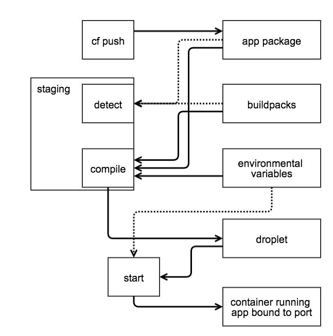

# Inside Look: Pushing cf-env to Cloud Foundry

To start, let's take a quick look at the status of our app. We can see the status of all running apps using the `cf apps` command:

```
$ cf apps
Getting apps in org quinn / space development as qanx@starkandwayne.com...
OK

name          requested state   instances   memory   disk   urls
cf-env-qanx   started           1/1         1G       1G     cf-env-qanx.cfapps.io
```

Currently we only have one application, so the output is pretty easy reading. If we wanted a little more information about that particular application, we can use `cf app <app name>`:

```
$ cf app cf-env-qanx
Showing health and status for app cf-env-qanx in org quinn / space development as qanx@starkandwayne.com...
OK

requested state: started
instances: 1/1
usage: 1G x 1 instances
urls: cf-env-qanx.cfapps.io

     state     since                    cpu    memory        disk
#0   running   2014-10-25 07:38:49 PM   0.0%   32.4M of 1G   42.4M of 1G
```

## So What Just Happened?



** First stop: The application package **

The first step of creating an application is getting the application files (including the code) into Cloud Foundry.

** Next stop: Staging **

A couple of tasks happen during the next phase, called "staging". First, Cloud Foundry detects what language the application is written in. Then, it uses a *buildpack* to download and install all the dependencies that the application needs to run. Finally, the application and its dependencies are stored in a tarball called a *droplet*.

** Last stop: Starting the Application **

Once the droplet has been created, it is installed on one or more *warden* containers and bound to the appropriate port(s). The running application can be accessed using the URI provided at the end of the `cf push` output.

### Buildpack? Droplet? What?

*** stuff ***


#### CF CLI Commands

A quick review of the commands covered in this section:

| Command | Usage |
|----------|--------|
| `cf apps` | Lists all apps and their statuses in the targeted space. |
| `cf app <app name>` | Provides application status for a specific app. |
