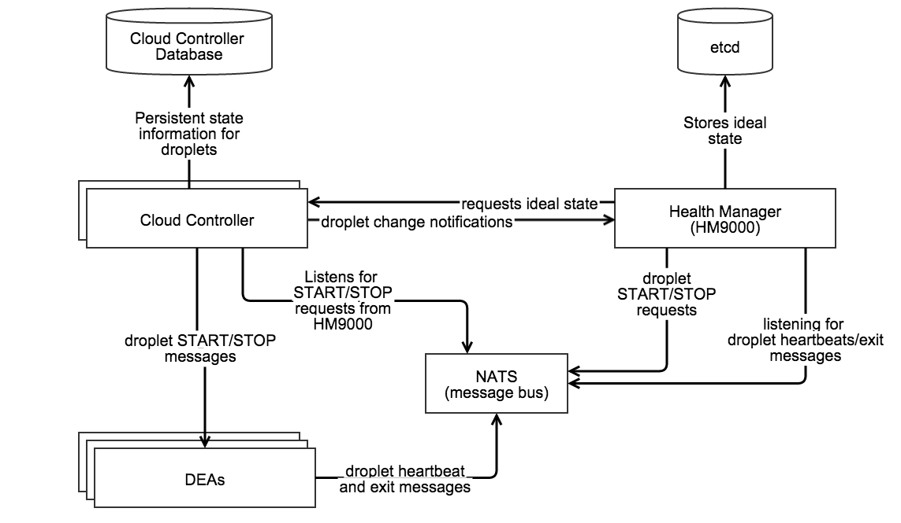

# Application Lifecycle

## Cloud Controller

### Resources
* [GitHub repo for the CC](https://github.com/cloudfoundry/cloud_controller_ng)
* [CF CC doc](http://docs.cloudfoundry.org/concepts/architecture/cloud-controller.html)
* [Interacting with the CC API](http://blog.pivotal.io/cloud-foundry-pivotal/products/working-with-the-cloud-controller-api-in-ruby-beyond-cfoundry)
* [Overview of all components](http://www.slideshare.net/ramnivas2/cloudfoundry-architecture)


## Health Manager

## What is the Health Monitor?

The purpose of the Health Monitor (HM) is to monitor all existing apps and ensure that the appropriate number of instances are running. If there is a discrepancy, then the HM will either prompt the Cloud Controller to start new instances (if there are too few) or stop existing instances (if there are too many).

### Some Background

The current release of the Health Monitor is called the  Health Monitor 9000 (usually seen as HM9000 or HM9K). The HM9K is a complete rewrite of the Health Monitor. According to the [release post](http://blog.cloudfoundry.org/2014/02/22/hm9000-ready-for-launch/), the maintainers' main goals for the rewrite were to:

* Solve the then-issue that the HM was a single point of failure
* Make use of newer technologies ([Go](https://golang.org/), [etcd](https://github.com/coreos/etcd) instead of [Ruby](https://www.ruby-lang.org/en/))
* Get into the practice of replacing existing components with rewrites

The switch to Go/etcd provides the key difference between the original HM and the HM9K: the ability to store information about the state of the environment in a database instead of in component memory. This not only allows multiple instances of the HM to work concurrently, but also keeps the information available in the event of a single component failure.

### How does the HM work?


<small>Source: home grown diagram made with [Gliffy](http://www.gliffy.com/).</small>

* Requests the ideal state of the droplets from the Cloud Controller
* Stores the ideal state in etcd
* Listens to droplet heartbeats over NATS to obtain the actual state of the droplets
* Sends droplet START/STOP requests over NATS
* Moves applications to DEAs during a rolling deploy

Since the HM9K has a great deal of control, it's been limited to only take actions if the information it is using is "fresh". Specifically:

* The actual state is "fresh" if the HM9K has an active NATS connection, is regularly receiving DEA heartbeats, and is able to successfully store the actual state into etcd.
* The desired state is "fresh" if the HM9K successfully downloads the desired state from Cloud Controller (without timing out) and successfully stores the information into etcd.

**If either the actual or desired states are not fresh, the HM9K will stop taking any actions.**

### What if something goes wrong?

Tips for troubleshooting the HM9K from [Onsi @ Pivotal](https://groups.google.com/a/cloudfoundry.org/d/msg/vcap-dev/xJP0GpqDyHc/ooysbM1_yEgJ) (who is now famous for his talk about [Diego](https://www.youtube.com/watch?v=1OkmVTFhfLY)):

* Make sure `hm9000_noop` is set correctly. When set to `false` the Cloud Controller will use the HM9K, but if set to `true` it will use health\_manager\_next. (which was the predecessor to the HM9K).
* [Verify that etcd is not in a bad state](https://github.com/cloudfoundry/hm9000#recovering-from-failure). Typically etcd will only enter a bad state during deployment rather than later. If etcd is in a bad state, you will notice that the HM9K will no longer be able to store current information about the state of the environment. When this happens you should restart etcd by doing the following:
 * `bosh ssh` into the etcd node
 * Run `monit stop all`
 * Delete the etcd data directory under `/var/vcap/store`
 * Repeat for all etcd nodes
 * Once complete for all nodes, restart them by running `monit start all`.
* Verify that Cloud Controller is able to send the desired state in time<sup>\*</sup>.  (Recall that if the data is not sent/received in time, then the state loses freshness and the HM9K will no longer take any action.) Check the logs of the `desired_state_fetcher` to view the status . Typically this is only a problem when the Cloud Controller is under heavy load.
 * <sup>\*</sup> What "in time" is and whether you can change it depends on your version of Cloud Foundry. As of [Jul 24 2014](https://github.com/cloudfoundry/cf-release/commit/c4690041bf0eda748fb6e23cf7b73e8147af051a) users can control the timeout value by setting the `hm9000.fetcher_network_timeout_in_seconds` parameter in the manifest. The default value is currently 30 seconds. Prior to this, the timeout was set to [10 seconds](https://github.com/cloudfoundry/cf-release/commit/c6b784820debd24911218e89bb68b35efe7e0a81) and was not user configurable.
* [Check the load on etcd](https://github.com/cloudfoundry/hm9000#if-clustered-etcd-cant-handle-the-load). According to the README, if the `DesiredStateSyncTimeInMilliseconds` exceeds ~5000 (5 seconds) and the `ActualStateListenerStoreUsagePercentage` exceeds 50-70% then clustered etcd *may* be unable to handle the load. The current workaround for this issue is to run a single HM9K node instead of a cluster.

**View the contents of the store**

If you `bosh ssh` into HM9K VM you can run:

`/var/vcap/packages/hm9000/hm9000 dump --config=/var/vcap/jobs/hm9000/config/hm9000.json`

This will fetch both the desired and actual state from etcd and print out a pretty-formatted birds-eye view of all running & desired apps on your cloud foundry installation.  You can also get raw JSON output by passing dump the `--raw` flag.

I have included some example output below. This is for a CF instance that has a single application with five instances:

```
$ /var/vcap/packages/hm9000/hm9000 dump --config=/var/vcap/jobs/hm9000/config/hm9000.json
Dump - Current timestamp 1418830322
Store is fresh
====================

Guid: 9d7923df-1e45-4201-943b-0cf2ec086ee9 | Version: 561f3b0c-8beb-4faa-af48-07b4f8ad379e
  Desired: [5] instances, (STARTED, STAGED)
  Heartbeats:
    [4 RUNNING] 2e9e4142946743f2ba5372cc1c29aa86 on 0-1c4
    [1 RUNNING] 5989d49130c8440aa86abf22c5f10215 on 0-1c4
    [2 RUNNING] 0673b4cc39464025b3d6ae6be5a9f285 on 0-1c4
    [3 RUNNING] ff875188ca73454aa67a0acf689b3e29 on 0-1c4
    [0 RUNNING] 017b2076a4024416bb8cee7dd86df59c on 0-1c4
```

RAW output for the above:
```
$ /var/vcap/packages/hm9000/hm9000 dump --config=/var/vcap/jobs/hm9000/config/hm9000.json --raw
Raw Dump - Current timestamp 1418830336
/hm/locks/Analyzer [TTL:9s]:
    9eefca86-cb36-4407-7af7-1d0b7a43df22
/hm/locks/Fetcher [TTL:8s]:
    66a2c18e-8095-4cd8-5e86-0a5a3d998c3e
/hm/locks/Sender [TTL:10s]:
    3fbb6b85-d608-433d-51b5-cd35d57e2150
/hm/locks/Shredder [TTL:8s]:
    5e699aa8-8af1-4013-7313-f57bfc9f72ce
/hm/locks/evacuator [TTL:7s]:
    6c39a226-bc89-40b5-67c9-b1644184ffe8
/hm/locks/listener [TTL:9s]:
    2be6e723-6edc-4b18-62f8-aec200be161d
/hm/locks/metrics-server [TTL:6s]:
    43014106-65db-4f36-5eb8-98a617108529
/hm/v4/actual-fresh [TTL:22s]:
    {
      "timestamp": 1418758444
    }
/hm/v4/apps/actual/9d7923df-1e45-4201-943b-0cf2ec086ee9,561f3b0c-8beb-4faa-af48-07b4f8ad379e/017b2076a4024416bb8cee7dd86df59c [TTL: ∞]:
    0,RUNNING,1418830256.8,0-1c470b76e6a34de396016de6484ea9e1
/hm/v4/apps/actual/9d7923df-1e45-4201-943b-0cf2ec086ee9,561f3b0c-8beb-4faa-af48-07b4f8ad379e/0673b4cc39464025b3d6ae6be5a9f285 [TTL: ∞]:
    2,RUNNING,1418830258.6,0-1c470b76e6a34de396016de6484ea9e1
/hm/v4/apps/actual/9d7923df-1e45-4201-943b-0cf2ec086ee9,561f3b0c-8beb-4faa-af48-07b4f8ad379e/2e9e4142946743f2ba5372cc1c29aa86 [TTL: ∞]:
    4,RUNNING,1418830258.2,0-1c470b76e6a34de396016de6484ea9e1
/hm/v4/apps/actual/9d7923df-1e45-4201-943b-0cf2ec086ee9,561f3b0c-8beb-4faa-af48-07b4f8ad379e/5989d49130c8440aa86abf22c5f10215 [TTL: ∞]:
    1,RUNNING,1418830258.6,0-1c470b76e6a34de396016de6484ea9e1
/hm/v4/apps/actual/9d7923df-1e45-4201-943b-0cf2ec086ee9,561f3b0c-8beb-4faa-af48-07b4f8ad379e/ff875188ca73454aa67a0acf689b3e29 [TTL: ∞]:
    3,RUNNING,1418830258.5,0-1c470b76e6a34de396016de6484ea9e1
/hm/v4/apps/desired/9d7923df-1e45-4201-943b-0cf2ec086ee9,561f3b0c-8beb-4faa-af48-07b4f8ad379e [TTL: ∞]:
    5,STARTED,STAGED
/hm/v4/dea-presence/0-1c470b76e6a34de396016de6484ea9e1 [TTL:22s]:
    0-1c470b76e6a34de396016de6484ea9e1
/hm/v4/desired-fresh [TTL:112s]:
    {
      "timestamp": 1418829728
    }
/hm/v4/metrics/ActualStateListenerStoreUsagePercentage [TTL: ∞]:
    0.00295
/hm/v4/metrics/DesiredStateSyncTimeInMilliseconds [TTL: ∞]:
    1.07322
/hm/v4/metrics/ReceivedHeartbeats [TTL: ∞]:
    13.00000
/hm/v4/metrics/SavedHeartbeats [TTL: ∞]:
    13.00000
/hm/v4/metrics/StartCrashed [TTL: ∞]:
    0.00000
/hm/v4/metrics/StartEvacuating [TTL: ∞]:
    0.00000
/hm/v4/metrics/StartMissing [TTL: ∞]:
    0.00000
/hm/v4/metrics/StopDuplicate [TTL: ∞]:
    0.00000
/hm/v4/metrics/StopEvacuationComplete [TTL: ∞]:
    0.00000
/hm/v4/metrics/StopExtra [TTL: ∞]:
    5.00000
```

For more information, please see the [HM9K README](https://github.com/cloudfoundry/hm9000#how-to-dump-the-contents-of-the-store-on-a-bosh-deployed-health-manager).

#### An example issue and its resolutions from VCAP Dev

**[Issue](https://groups.google.com/a/cloudfoundry.org/d/msg/vcap-dev/xJP0GpqDyHc/m-5dBKIqqAsJ):** `cf apps` shows 0/N apps running

Specifically, the output shows:

```
Showing health and status for app rubytest in org org / space space as user...
OK

requested state: started
instances: 0/1
usage: 1G x 1 instances
urls: rubytest.mydomain.dev

     state     since                    cpu    memory        disk
#0   running   2014-03-20 12:00:19 PM   0.0%   76.2M of 1G   58.7M of 1G
```

The logs show some bizarre behavior as well:

```
{"timestamp":1395331896.365486,"message":"harmonizer: Analyzed 1 running 1 missing instances. Elapsed time: 0.009356267","log_level":"info","source":"hm","data":{},"thread_id":16810120,"fiber_id":24014660,"process_id":6740,"file":"/var/vcap/packages/health_manager_next/health_manager_next/lib/health_manager/harmonizer.rb","lineno":229,"method":"finish_droplet_analysis"}
```

Followed later by:

```
{"timestamp":1395332173.518845,"message":"harmonizer: droplet GC ran. Number of droplets before: 2, after: 1. 1 droplets removed","log_level":"info","source":"hm","data":{},"thread_id":16810120,"fiber_id":24014660,"process_id":6740,"file":"/var/vcap/packages/health_manager_next/health_manager_next/lib/health_manager/harmonizer.rb","lineno":184,"method":"gc_droplets"}
```

So although initially the number of running applications is incorrectly identified, at some point the HM9K does clean up the extra instance.

**Solution:** The poster of the above indicated that the solution to his issue was that the Cloud Controller was working with the incorrect Health Monitor - health\_manager\_next instead of HM9K.

A [later poster](https://groups.google.com/a/cloudfoundry.org/d/msg/vcap-dev/xJP0GpqDyHc/jXrHO873Rc0J) was using the HM9K and reported an experience with the same behavior. By running `cf apps` he saw output similar to the above for all his apps, and when he tailed `/var/vcap/sys/log/hm9000/hm9000_listener.stdout.log` there were no logged heartbeats.

He stated that he discovered that the issue was caused by his etcd nodes becoming unclustered. Since he could not directly resolve the issue, he followed the steps for what to do when etcd entered a bad state and successfully re-created the cluster.

#### Resources

* [HM9000 GitHub Repository](https://github.com/cloudfoundry/hm9000)
* [HM9000 Release Statement](http://blog.cloudfoundry.org/2014/02/22/hm9000-ready-for-launch/)
* [Cloud Foundry Developers User Group](https://groups.google.com/a/cloudfoundry.org/forum/#!forum/vcap-dev)
 * In particular, a great source of information was [Onsi's post about the HM9000](https://groups.google.com/a/cloudfoundry.org/d/msg/vcap-dev/xJP0GpqDyHc/ooysbM1_yEgJ)


#### Additional Resources [Need to Review]
* [GitHub repo for HM9000](https://github.com/cloudfoundry/hm9000)
* [GitHub repo for the now-deprecated Health Manager](https://github.com/cloudfoundry/health_manager)
 * Make sure to reference that, when reading, the terms "Health Manager" and "HM9000" are interchangeable, with the former being more commonly used.
* [CF HM blurb](http://docs.cloudfoundry.org/concepts/architecture/#hm9k)
 * Same information on [Pivotal doc page](http://docs.pivotal.io/pivotalcf/concepts/architecture/#hm9k)
* [CF Blog for HM9K release](http://blog.cloudfoundry.org/2014/02/22/hm9000-ready-for-launch/)
* Question on [Stack Overflow](http://stackoverflow.com/questions/24533410/health-manager-in-cloud-foundary)
* [Onsi and HM9K](http://www.activestate.com/blog/2014/09/cloud-foundry-diego-explained-onsi-fakhouri)


