# Getting Started with Pivotal Web Services and Cloud Foundry

Cloud Foundry is an open source platform as a service (PaaS) that is maintained by Pivotal Software, which is funded by VMWare and EMC.

The easiest way to get started with Cloud Foundry is to set up the necessary tools. Although customers can run their own private cloud with Cloud Foundry, to minimize setup we will be using Pivotal Web Services to work with Cloud Foundry.

## Setting Up Pivotal Web Services

To use Pivotal Web Services (PWS), you can set up an account to take advantage of their free 60 day trial.

1. Go to [console.run.pivotal.io](https://console.run.pivotal.io/)
1. Click "Create account"<br />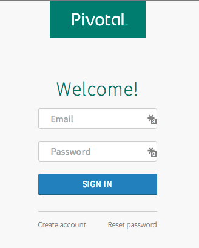
1. Enter your email address<br />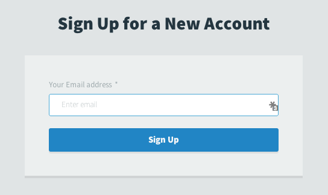
1. You will need to wait to receive a setup email from Pivotal, this took approximately 15 minutes to arrive.<br >
1. Click the link in your email.<br />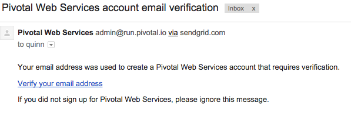
1. Enter your cell phone number (Google voice number works as well). You will be texted a confirmation code.<br />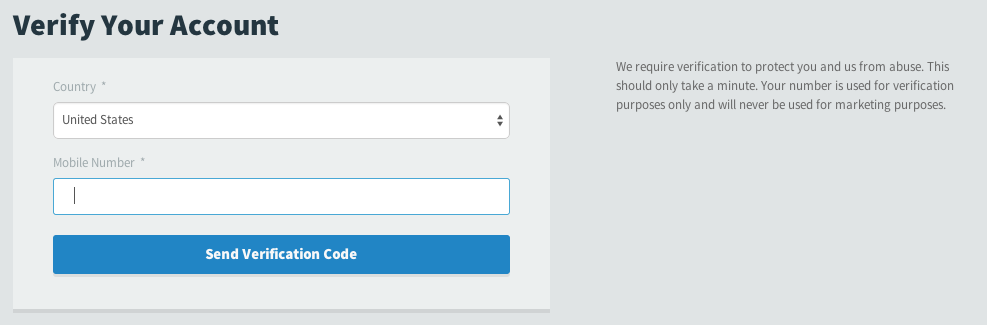
1. Enter your confirmation code<br />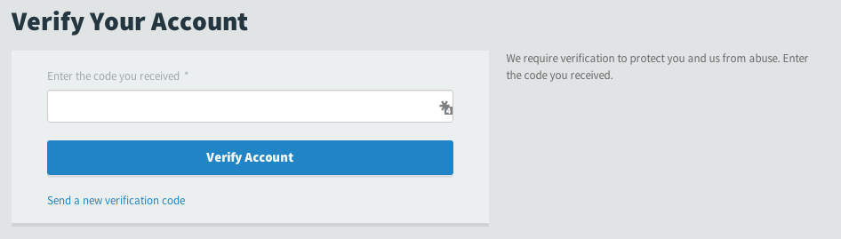
1. Create your first org. More details will be provided for this later, but you will need to choose a unique name. I also recommend choosing a short name since you will want to be able to type it quickly and easily when you are using the CLI tools.<br />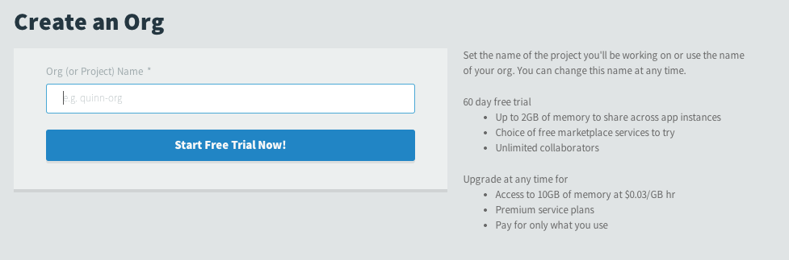
1. You have successfully created your account!<br />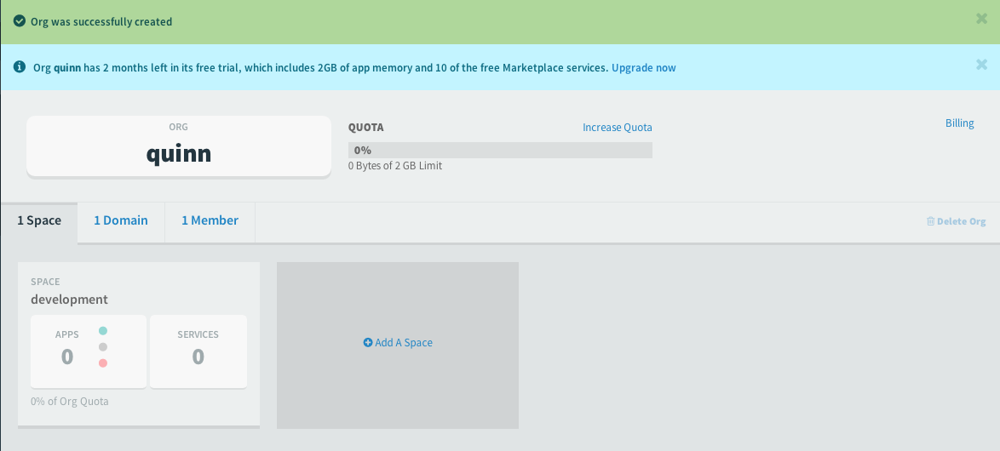

## Quick Overview of Your PWS Account

This is just a quick overview of where you can find different features in the PWS web interface. What these features are and how to use them will be discussed in later chapters.

### Spaces, Domains, and Users

By default, your first org will have one space called "development" created. We will use this space later to push our applications and create/bind services:<br />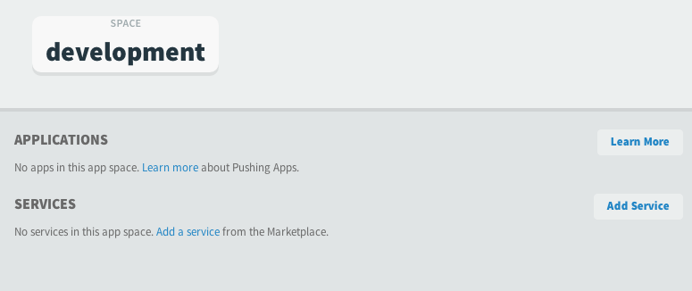

There is also a tab listing your domains:<br />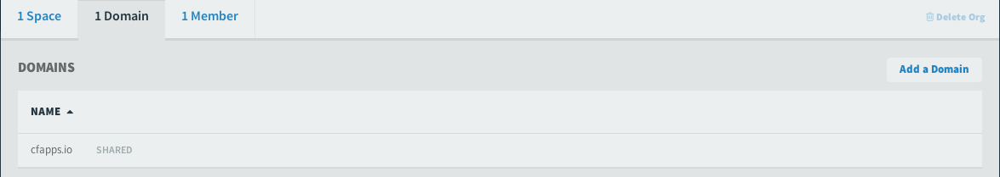

By default, all PWS users have access to the cfapps.io domain. You can also choose to add additional domains using the "Add a Domain" button on the right:<br />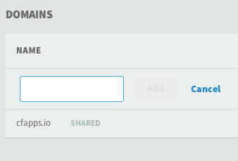


All new accounts have a single member - the person who created the account:<br />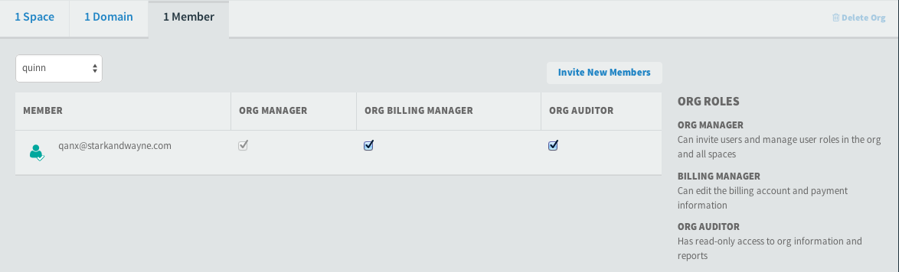

If you wanted to add additional members, you can do so with the "Invite New Members" button:<br />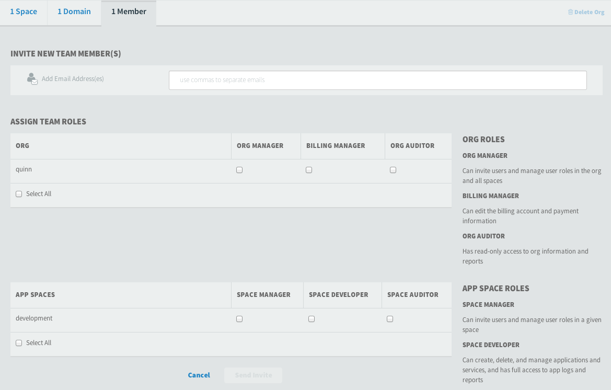

### Billing

Although you will not be billed for the first two months, you can view how the charges will accrue over the course of the month by clicking the "Billing" link in the upper right:<br />

Since this is a new account with no applications there are no initial charges listed. Once you start accruing charges you will see them credited to your account during the trial period:<br />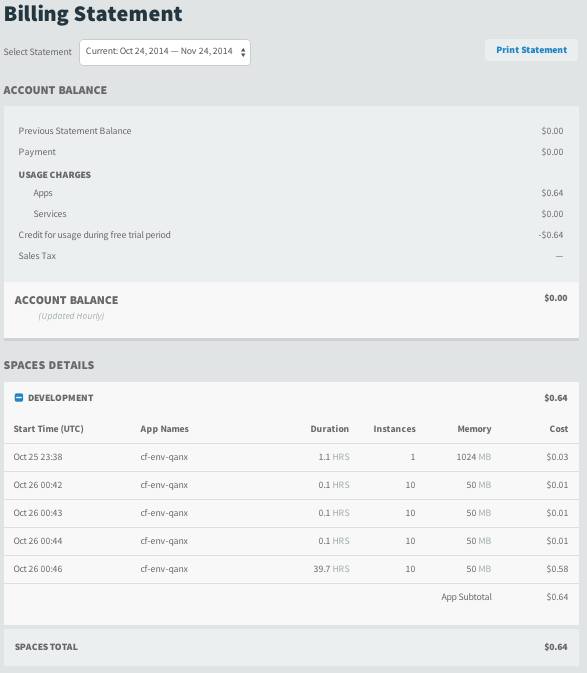

### The Marketplace

The free two month trial gives us access to the services in Pivotal's Marketplace, which stores all the services that we can use with our applications. You can view the services available by clicking the `Marketplace` item on the navigation bar to the left:<br />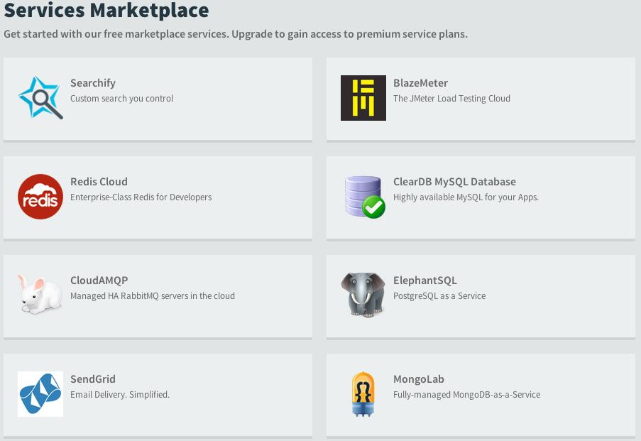

Please note: not all services are free. For the examples in the book we will be sticking to free services; however, you can choose to use paid services if you wish.

### Docs, Support, etc.

The links located on the navigation bar below the Orgs and Spaces will open in a new tab or window by default. These links are: [Docs](http://docs.run.pivotal.io/), [Support](http://support.run.pivotal.io/), [Tools](https://console.run.pivotal.io/tools), [Blog](http://blog.cloudfoundry.com/), and [Status](http://status.run.pivotal.io/). Of these, only [Tools](https://console.run.pivotal.io/tools) will open in a new window that is still in the PWS web interface.

## Installing the CF CLI Tools

If you have not already done so, or if you are running an older version, you will need to install the CF command line tools. To download the tools, you can go to the [Tools](https://console.run.pivotal.io/tools) link on the left navigation bar:<br />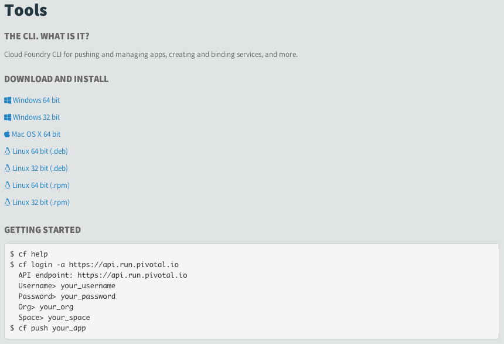

Click the package installer matches your OS and go through the prompts. Once complete you should be able to open terminal/the command prompt and check the version:

```
$ cf --version
cf version 6.6.2-0c953cf-2014-10-17T18:10:36+00:00
```

You can also download the latest installer for your OS from [Cloud Foundry's CLI repository on GitHub](https://github.com/cloudfoundry/cli#downloads). Please be sure to read the README's warning about using the Edge Binaries.

Note for Mac OS X users: Cloud Foundry developers have been working on adding a way to install the CLI using Homebrew. This process is still experimental, but feel free to try at your own risk:

```
$ brew tap pivotal/tap
$ brew install cloudfoundry-cli
```

More information about the initial CF CLI tools setup is available on the [Cloud Foundry Docs](http://docs.cloudfoundry.org/devguide/#cf) page.

**Please note:** Most work done in Cloud Foundry is done using the CLI and not the web UI. As such, please make sure that you have successfully installed the CLI tools before proceeding.

## Setting up TryCF on Amazon Web Services

Although we will be using PWS for the majority of our exercises, you can also use Amazon Web Services (AWS) and TryCF. TryCF creates an EC2 instance in your AWS account and installs Cloud Foundry for you. The process typically takes 15-20 minutes.

Similar to PWS, AWS has a free trial period where you will have access to their tools and services.

### Use TryCF to install Cloud Foundry

Please do the following:

1. Set up a free trial AWS account at [https://aws.amazon.com/](aws.amazon.com)
1. Go to **PATH** and download your Access Key ID and Secret Access Key. This will be in a CSV file.
  * Do NOT lose this information as it cannot be recovered at a later time. I recommend saving locally and a backup (or two) of the CSV file.
1. Go to [trycf.starkandwayne.com](https://trycf.starkandwayne.com/) and enter the following information (depending on your screen size/resolution you may need to scroll):
  * The email address associated with your AWS account
  * Your AWS Access Key ID
  * Your AWS Secret Access Key<br />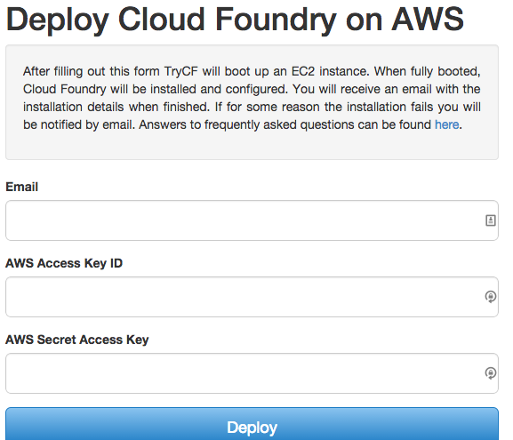
1. Wait for your confirmation email:<br />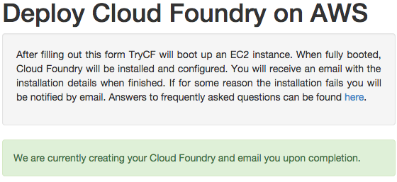
1. Open your confirmation email:<br />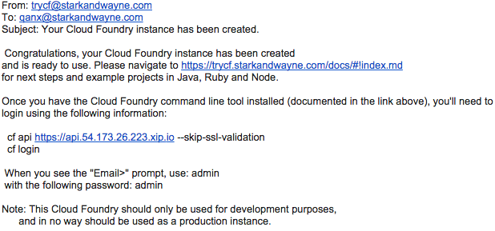
1. Target the API and log in using the instructions in the email. You do not need to download the `trycf.pem` key unless you plan on SSHing into your EC2 instance.

## Setting up your own Cloud Foundry

The goal of using services such as PWS and TryCF are to minimize the barrier to entry so you can use Cloud Foundry right away with minimal setup. That said, as external services both PWS and TryCF come with limitations:
* PWS handles most of the administrative tasks for running Cloud Foundry, certain administration features are disabled for their users. These are pointed out in the book as they are encountered.
* TryCF is limited to specific releases of Cloud Foundry due to the way it automates the deployment on AWS EC2 servers. Currently, TryCF is using v170 (released May 2014). The list of Cloud Foundry releases can be viewed [here](https://github.com/cloudfoundry/cf-release/releases).

If you would like to avoid the limitations that are inherit with third party providers and set up your own Cloud Foundry, then you can do so by following the instructions below. If you plan on running Cloud Foundry locally, please verify that your laptop/workstation meets the minimum system requirements. The next two subsections detail how to install Cloud Foundry either locally or on an AWS EC2 instance.


