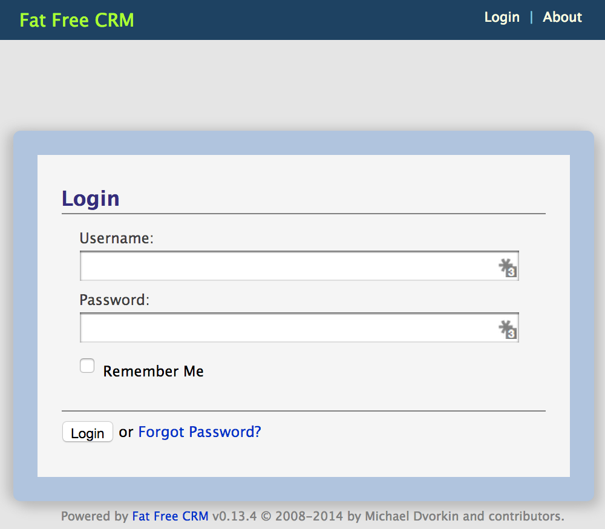
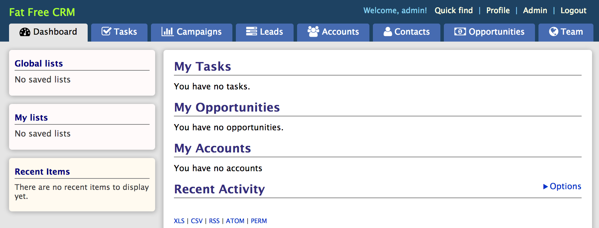

# FatFreeCRM

Install difficulty: **Easy**<br />
Reason for difficulty rating: Minimal edits prior to deploy, based off Heroku instructions<br />
Primary Language: **Ruby**

---

Before you begin, please open terminal and make sure that:
* You have targeted the PWS API (`https://api.run.pivotal.io`)
* You are logged into the correct account (if you have multiple)
* You are targeting the desired org and space (if you have multiple)

---

Before we proceed, the [Fat Free CRM](https://github.com/fatfreecrm/fat_free_crm) GitHub has a link to their [Heroku Installation instructions](http://guides.fatfreecrm.com/Setup-Heroku.html). Since Cloud Foundry and Heroku are very similar, we can use these as the basis for our installation. From these instructions and the README in GitHub we can see that:

* The application requires a database: either MySQL, SQLite, or Postgres
* The application requires several Rails commands to be run when it is pushed.

## Database Configuration

For this deployment I will create a postgres database. With PWS, the free Tiny Turtle plan with ElephantSQL is more than adequate:

```
$ cf create-service elephantsql turtle fatfreedb
Creating service fatfreedb in org quinn / space development as quinn@thecodingmant.is...
OK
```

If you have a preference for MySQL, you can use the free Spark plan with ClearDB instead.


## Deploying the Application

Add `ruby "2.0.0"` underneath the first line of your `Gemfile`, which should be `source 'https://rubygems.org'`. The first few lines should now look like this:

```ruby
source 'https://rubygems.org'
ruby "2.0.0"

# Uncomment the database that you have configured in config/database.yml
# ----------------------------------------------------------------------
# gem 'mysql2'
# gem 'sqlite3'
gem 'pg'
```

Notice that by default the `Gemfile` is using postgres. If you are going to use MySQL instead of postgres, then you would need to uncomment `gem 'mysql2'` and comment `gem 'pg'`.

To deploy our application, we're going to use a manifest file. For this deployment, I have set `random-route` to `true` and added the `fatfreedb` service:

```yaml
---
applications:
- name: fatfreecrm
  random-route: true
  services:
  - fatfreedb
```

From the Heroku installation instructions, we can see that the following Rails commands need to be run:

```
heroku run rake db:migrate
heroku run rake ffcrm:demo:load (if you want demo data)
heroku run rake ffcrm:setup:admin USERNAME=admin PASSWORD=admin EMAIL=admin@example.com
```

Taking a quick look at [Pivotal's instructions for deploying Rails apps to Cloud Foundry](http://pivotallabs.com/deploying-a-rails-app-to-cloudfoundry/), we can see that these can only be run with `cf push` - either using the `-c` or `--command` flags or using a manifest. To keep everything in one place, we're going to add the commands to our `manifest.yml` file:

```yaml
---
applications:
- name: fatfreecrm
  random-route: true
  command: "bundle exec rake db:migrate && bundle exec rake ffcrm:setup:admin USERNAME=admin PASSWORD=admin EMAIL=quinn@thecodingmant.is && bundle exec rails s -p $PORT"
  services:
  - fatfreedb
```

**FYI for non-Ruby developers:** I also added `bundle exec rails s -p $PORT"` to start the rails server and bind it to Cloud Foundry's `$PORT` environmental variable.


Now we can push our app with `cf push`. Due to the number of dependencies this make take a few minutes, so you may want to take the opportunity to stretch and get your favorite coffee, tea, etc. Once the application is up and running you can view the login page:



By default, you can log into the user name and password `admin`. Once you are logged in, you can start playing around with the application's Dashboard:




**Some important notes:**

* There are many dependencies, so when you push your application you will see several messages such as `installing rake (x.x.x)` (where x.x.x is the appropriate version). This process will take a few minutes.
* You may see the following output to terminal one or more times during the building process:<br />`fatal: Not a git repository (or any of the parent directories): .git`<br />This message can be ignored.
* There will be a delay before the app can start, so you may see the following line several times:<br />`0 of 1 instances running, 1 starting`<br />This may go on for a few minutes. Be patient! Eventually a message will appear that the app has started and its deploy information will display.

