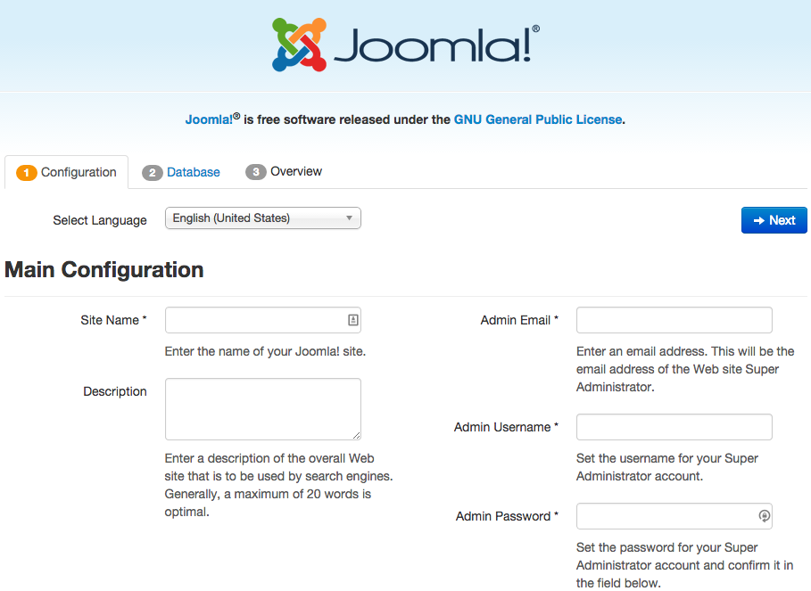

# Joomla

Install difficulty: **Easy**<br />
Reason for difficulty rating: Minimal edits prior to deploy<br />
Primary Language: **PHP**

---

Before you begin, please open terminal and make sure that:
* You have targeted the PWS API (`https://api.run.pivotal.io`)
* You are logged into the correct account (if you have multiple)
* You are targeting the desired org and space (if you have multiple)

---


1. Go to the [Joomla download page](http://www.joomla.org/download.html) and download the latest version (ZIP file)
 * You can also use curl to download the latest release from [JoomlaCode's release page](http://joomlacode.org/gf/project/joomla/frs/). e.g.: <br />`curl -Ok -L http://joomlacode.org/gf/download/frsrelease/19822/161256/Joomla_3.3.6-Stable-Full_Package.zip`
1. Uncompress the ZIP file in the parent directory of wherever you want to store the Joomla app
 * You may want to change the name of the extracted folder to something shorter, e.g. `joomla`.
1. According to the [documentation](http://docs.joomla.org/Portal:Learn_More) Joomla uses MySQL, so we need to create a MySQL service instance: <br />`cf create-service cleardb spark joomla-db`
1. Create a `manifest.yml` file. For now, we will only include the application name and services. (Unless you want the hostname to differ from the application name, in which case you need to specify `host` as well.)
 * In lieu of a manifest, you can bind the service (`cf bind-service`) and restage the app (`cf restage`) after the initial push.
1. Push the app: <br />`cf push`

Once your application has started, you can go to your browser and start the setup process:




## Fine tuning resource usage

According to the [Cloud Foundry documentation on GitHub](https://github.com/cloudfoundry-community/cf-docs-contrib/wiki/Joomla-CMS-on-Cloud-Foundry-v2), the recommended buildpack to deploy Joomla is `heroku-buildpack-php-tyler`. I updated my `manifest.yml` file to include the buildpack:

```yaml
---
applications:
- name: joomla
  memory: 128M
  disk_quota: 500M
  buildpack: https://github.com/iphoting/heroku-buildpack-php-tyler.git
  host: joomla-${random-word}
  services:
  - joomla-db
```

Then I was able to successfully deploy the application with the same results as above - except the resource usage was significantly less. With the offline buildpack the application was using ~100 MB of memory and ~250 MB of disk, but with the 3rd party buildpack the application only neds ~70 MB of memory and 150 MB of disk. Over time, this will significantly reduce the total cost of ownership for your app.

