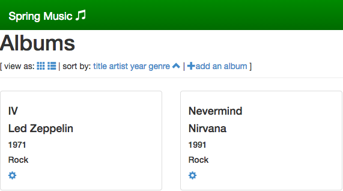

# Spring Music

Install difficulty: **Easy**<br />
Reason for difficulty rating: Minimal edits prior to deploy, create service instance (optional)<br />
Primary Language: **Java**

---

Before you begin, please open terminal and make sure that:
* You have targeted the PWS API (`https://api.run.pivotal.io`)
* You are logged into the correct account (if you have multiple)
* You are targeting the desired org and space (if you have multiple)

---

## Setting up application

1. Clone the repo: <br />`git clone https://github.com/cloudfoundry-samples/spring-music.git`
1. Optional changes to `manifest.yml`:
  * If you want to have matching `host` and application names, then change the application name to something unique and delete the `host` line.
  * If you do not want to use the randomly generated `host`, but still want the `host` to be different from the application name, change the `host` field to something unique. (I'll admit that I do get a kick out of the randomly generated names though.)
1. Run the following in terminal: <br />`./gradlew assemble`
1. Push application: <br />`cf push`

The running application should look similar to this:



**Note: ** You may encounter a warning when running the gradlew script, for example:

```
$ ./gradlew assemble
:compileJava
warning: [options] bootstrap class path not set in conjunction with -source 1.7
1 warning
:processResources
:classes
:war
:assemble

BUILD SUCCESSFUL

Total time: 28.393 secs
```

This warning will not impact the running the application for our purpose.

## Adding a database

According to the [README](https://github.com/cloudfoundry-samples/spring-music):

> Using the provided manifest, the application will be created without an external database (in the `in-memory` profile). You can create and bind database services to the application using the information below.

So we can run the app in memory on Cloud Foundry, but we will not have any persistent storage. In most cases this will be ok as a demo; however, if you would like to play around with the application you will need to create a user provided service for database storage and bind it to the application.

The README details how to create a user provided service, which would be necessary if you do not have access to any existing databases in your marketplace. If you are using PWS as a PaaS provider, you have access to both ClearDB (MySQL) and ElephantSQL (postgreSQL). The free tier of either (5 MB for ClearDB and 20 MB for ElephantSQL) is more than enough to handle our little app ("out of the box" it only requires ~0.2 MB).

** ClearDB **

Create the service, bind the service, and restage the application:

```
$ cf create-service cleardb spark springm-db
Creating service springm-db in org quinn / space development as quinn@thecodingmant.is...
OK

$ cf bind-service spring-music springm-db
Binding service springm-db to app spring-music in org quinn / space development as quinn@thecodingmant.is...
OK
TIP: Use 'cf restage' to ensure your env variable changes take effect

$ cf restage spring-music
Restaging app spring-music in org quinn / space development as quinn@thecodingmant.is...
OK

[Removed for brevity]

-----> Uploading droplet (66M)

0 of 1 instances running, 1 starting
1 of 1 instances running

App started

Showing health and status for app spring-music in org quinn / space development as quinn@thecodingmant.is...
OK

requested state: started
instances: 1/1
usage: 512M x 1 instances
urls: spring-music-unburst-reappointment.cfapps.io

     state     since                    cpu    memory           disk
#0   running   2014-11-13 03:16:08 PM   0.0%   379.9M of 512M   131M of 1G
```

** ElephantSQL **

Using the same process as ClearDB, except with the new service provider:

```
$ cf create-service elephantsql turtle springm-pg
Creating service springm-pg in org quinn / space development as quinn@thecodingmant.is...
OK

$ cf bind-service spring-music springm-pg
Binding service springm-pg to app spring-music in org quinn / space development as quinn@thecodingmant.is...
OK
TIP: Use 'cf restage' to ensure your env variable changes take effect

$ cf restage spring-music
Restaging app spring-music in org quinn / space development as quinn@thecodingmant.is...
OK
-----> Downloaded app package (21M)
-----> Downloaded app buildpack cache (47M)
-----> Uploading droplet (66M)

0 of 1 instances running, 1 starting
0 of 1 instances running, 1 starting
1 of 1 instances running

App started

Showing health and status for app spring-music in org quinn / space development as quinn@thecodingmant.is...
OK

requested state: started
instances: 1/1
usage: 512M x 1 instances
urls: spring-music-unburst-reappointment.cfapps.io

     state     since                    cpu    memory           disk
#0   running   2014-11-13 03:50:56 PM   0.0%   391.1M of 512M   131M of 1G
```

**Note: ** If you intend to continue to use the app with either database service, I recommend updating `manifest.yml` to include the service instance. For example, using the postgreSQL instance:

```
---
applications:
- name: spring-music
  memory: 512M
  instances: 1
  host: spring-music-${random-word}
  path: build/libs/spring-music.war
  services:
  - springm-pg
```
