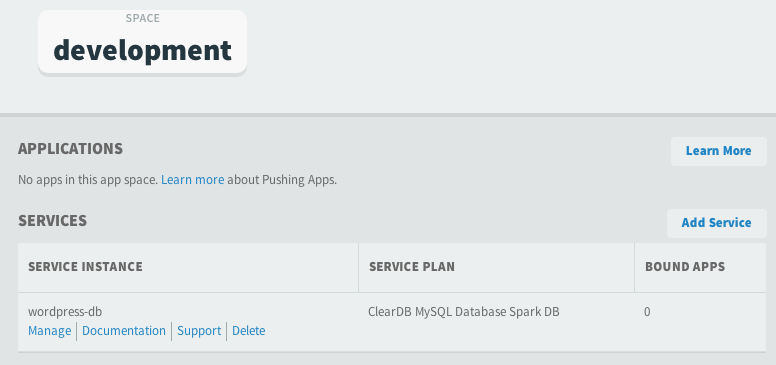
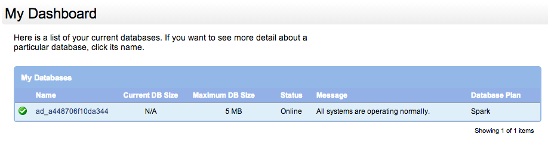
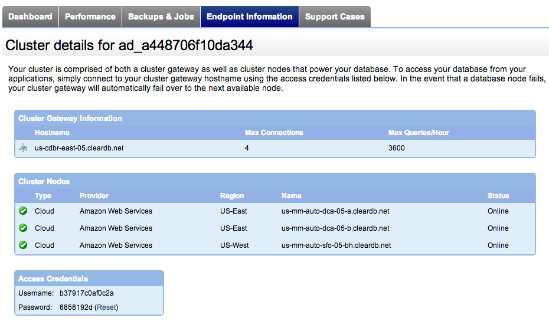
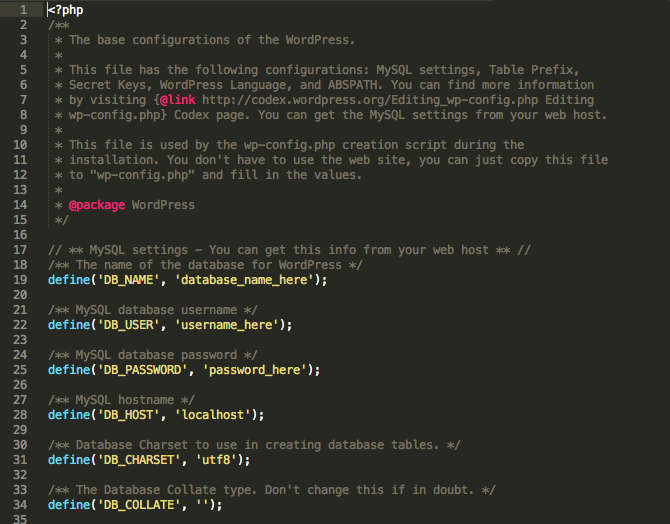
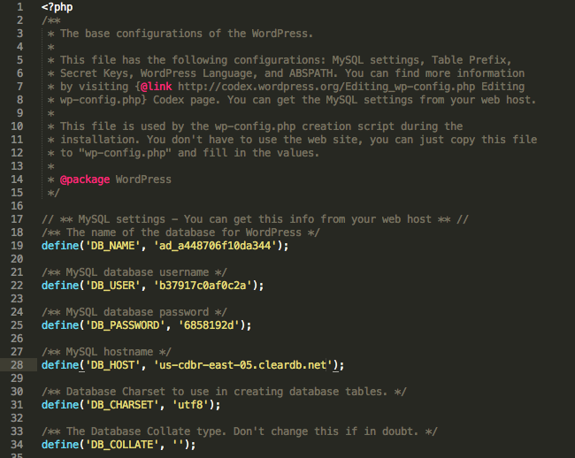
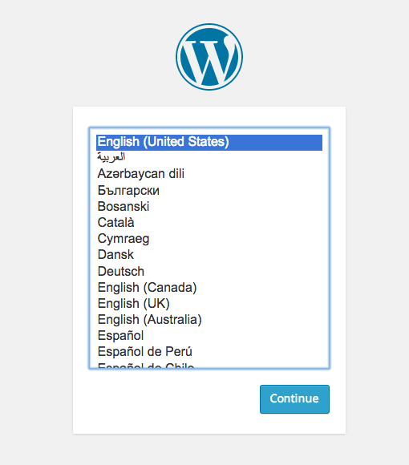

# Wordpress

Install difficulty: **Average**<br />
Reason for difficulty rating: Need to set up services, edit configuration file<br />
Primary Language: **PHP**

---

Before you begin, please open terminal and make sure that:
* You have targeted the PWS API (`https://api.run.pivotal.io`)
* You are logged into the correct account (if you have multiple)
* You are targeting the desired org and space (if you have multiple)

---

To begin, take a quick glance through the [Wordpress installation instructions](http://codex.wordpress.org/Installing_WordPress). Here, we can deduce a couple of things:

* Wordpress is a PHP application, so we will need a PHP buildpack
* Wordpress requires a MySQL database, so we will need to create a MySQL service instance

## Database Configuration

Let's start by creating our MySQL database. The MySQL service available to PWS is cleardb:

```
$ cf m | grep -i mysql
cleardb          spark, boost, amp, shock                                              Highly available MySQL for your Apps.
```

We will be using `spark`, which is the free tier and more than adequate for this installation. If you would like to take a look at the different tiers, please view the Marketplace in the [PWS Console](https://console.run.pivotal.io/).

Create the service:

```
$ cf create-service cleardb spark wordpress-db
Creating service wordpress-db in org quinn / space development as [email removed]...
OK
```

In order to configure the service and obtain the database credentials (to be used later), we will need to go into the PWS console:



Click "Manage" (this will open a new tab and pass your credentials) and then click on your database name:



Go to Endpoint Information:



Make note of the following parameters (they will be needed later). Please note that the values below are my values as you can see in the screenshots, your values will differ:

| field | value |
|-------|-------|
| db name | ad_a448706f10da344 |
| db user | b37917c0af0c2a |
| db password | 6858192d |
| hostname | us-cdbr-east-05.cleardb.net |

## Preparing Wordpress for Deploy

Now go to the folder where you will download the Wordpress tarball. Then download the tarball and untar the file:

```

$ wget http://wordpress.org/latest.tar.gz
--2014-11-10 20:12:10--  http://wordpress.org/latest.tar.gz
Resolving wordpress.org... 66.155.40.250, 66.155.40.249
Connecting to wordpress.org|66.155.40.250|:80... connected.
HTTP request sent, awaiting response... 302 Moved Temporarily
Location: https://wordpress.org/latest.tar.gz [following]
--2014-11-10 20:12:10--  https://wordpress.org/latest.tar.gz
Connecting to wordpress.org|66.155.40.250|:443... connected.
HTTP request sent, awaiting response... 200 OK
Length: 6051082 (5.8M) [application/octet-stream]
Saving to: 'latest.tar.gz'

100%[===============================================================================================>] 6,051,082   1.28MB/s   in 5.3s

2014-11-10 20:12:16 (1.09 MB/s) - 'latest.tar.gz' saved [6051082/6051082]

$ tar xfz latest.tar.gz
```

This creates a `wordpress` subdirectory. Change your current working directory to this directory.

```
$ cd wordpress
```

The application will look for a configuration file named `wp-config.php`, which is created by editing `wp-config-sample.php`. (I recommend just renaming `wp-config-sample.php` to `wp-config.php`.)

```
$ mv wp-config-sample.php wp-config.php
```

Open `wp-config.php` in your text editor of choice. It will look something like:



Now, copy the database information we gathered previously into the appropriate fields:



## Push Wordpress to Cloud Foundry

Since this is a PHP application, we should make sure we have a PHP buildpack available:

```
$ cf buildpacks | grep -i php
php_buildpack       7          true      false    php_buildpack-offline-v1.0.2.zip
```

Looks like we do, so let's go ahead. For now, we'll just push with the defaults:

```
$ cf push wordpress-$(whoami)
Creating app wordpress-qanx in org quinn / space development as [email removed]...
OK

Using route wordpress-qanx.cfapps.io
Binding wordpress-qanx.cfapps.io to wordpress-qanx...
OK

Uploading wordpress-qanx...
Uploading app files from: /Users/qanx/Development/Books/AppsForBook/wordpress
Uploading 10.3M, 1231 files
OK

Starting app wordpress-qanx in org quinn / space development as [email removed]...
OK
-----> Downloaded app package (6.3M)
-------> Buildpack version 1.0.2
Use locally cached dependencies where possible
 !     WARNING:        No composer.json found.
       Using index.php to declare PHP applications is considered legacy
       functionality and may lead to unexpected behavior.
       See https://devcenter.heroku.com/categories/php
-----> Setting up runtime environment...
       - PHP 5.5.12
       - Apache 2.4.9
       - Nginx 1.4.6
-----> Installing PHP extensions:
       - opcache (automatic; bundled, using 'ext-opcache.ini')
-----> Installing dependencies...
       Composer version ac497feabaa0d247c441178b7b4aaa4c61b07399 2014-06-10 14:13:12
       Warning: This development build of composer is over 30 days old. It is recommended to update it by running "/app/.heroku/php/bin/composer self-update" to get the latest version.
       Loading composer repositories with package information
       Installing dependencies
       Nothing to install or update
       Generating optimized autoload files
-----> Building runtime environment...
       NOTICE: No Procfile, defaulting to 'web: vendor/bin/heroku-php-apache2'

-----> Uploading droplet (69M)

0 of 1 instances running, 1 starting
1 of 1 instances running

App started

Showing health and status for app wordpress-qanx in org quinn / space development as [email removed]...
OK

requested state: started
instances: 1/1
usage: 1G x 1 instances
urls: wordpress-qanx.cfapps.io

     state     since                    cpu    memory        disk
#0   running   2014-11-12 10:58:46 PM   0.0%   92.6M of 1G   230.9M of 1G
```

Looks like everything is running, so let's take a look at our web page:


This is actually ok, because our service instance isn't bound to our app yet. We can bind our service using `cf bind-service`:

```
$ cf bind-service wordpress-$(whoami) wordpress-db
Binding service wordpress-db to app wordpress-qanx in org quinn / space development as [email removed]...
OK
TIP: Use 'cf restage' to ensure your env variable changes take effect

$ cf restage wordpress-$(whoami)
Restaging app wordpress-qanx in org quinn / space development as [email removed]...
OK
-----> Downloaded app package (6.3M)
-----> Downloaded app buildpack cache (4.0K)
Use locally cached dependencies where possible
       Using index.php to declare PHP applications is considered legacy
-----> Setting up runtime environment...
       - PHP 5.5.12
       - Apache 2.4.9
       - Nginx 1.4.6
-----> Installing PHP extensions:
       - opcache (automatic; bundled, using 'ext-opcache.ini')
-----> Installing dependencies...
       Composer version ac497feabaa0d247c441178b7b4aaa4c61b07399 2014-06-10 14:13:12
       Warning: This development build of composer is over 30 days old. It is recommended to update it by running "/app/.heroku/php/bin/composer self-update" to get the latest version.
       Loading composer repositories with package information
       Installing dependencies
       Nothing to install or update
       Generating optimized autoload files
-----> Building runtime environment...
       NOTICE: No Procfile, defaulting to 'web: vendor/bin/heroku-php-apache2'

-----> Uploading droplet (69M)

0 of 1 instances running, 1 starting
1 of 1 instances running

App started

Showing health and status for app wordpress-qanx in org quinn / space development as [email removed]...
OK

requested state: started
instances: 1/1
usage: 1G x 1 instances
urls: wordpress-qanx.cfapps.io

     state     since                    cpu    memory        disk
#0   running   2014-11-12 11:01:42 PM   0.0%   96.7M of 1G   230.9M of 1G
```

Let's see how our app looks now:



Success! (Application setup is left as an exercise.)

## Additional Deployment Options and Discussion

### Manifests

As always, creating a manifest file simplifies the push process:

```yaml
---
applications:
- name: wordpress-qanx
  services:
  - wordpress-db
```

This allows us to bind the service to the application during deployment, as opposed to a separate step.

### Deploy with a third party buildpack

While looking through Wordpress deploys, I found that GitHub user dmikusa (as of this writing employed at Pivotal) had created an [example Wordpress install](https://github.com/dmikusa-pivotal/cf-ex-wordpress) with Wordpress 4.0. I noticed his manifest used a [different PHP buildpack](https://github.com/dmikusa-pivotal/cf-php-build-pack) that he had also built. Let's see what happens to our app with the addition of the buildpack. First, updating our manifest file:

```yaml
---
applications:
- name: wordpress-qanx
  buildpack: https://github.com/dmikusa-pivotal/cf-php-build-pack.git
  services:
  - wordpress-db
```

Then deploying the app:

```
$ cf push
Using manifest file /Users/qanx/Development/Books/AppsForBook/wordpress/manifest.yml

Creating app wordpress-qanx in org quinn / space development as [email removed]...
OK

Using route wordpress-qanx.cfapps.io
Binding wordpress-qanx.cfapps.io to wordpress-qanx...
OK

Uploading wordpress-qanx...
Uploading app files from: /Users/qanx/Development/Books/AppsForBook/wordpress
Uploading 10.3M, 1230 files
OK
Binding service wordpress-db to app wordpress-qanx in org quinn / space development as [email removed]...
OK

Starting app wordpress-qanx in org quinn / space development as [email removed]...
OK
-----> Downloaded app package (6.3M)
-----> Uploading droplet (17M)

1 of 1 instances running

App started

Showing health and status for app wordpress-qanx in org quinn / space development as [email removed]...
OK

requested state: started
instances: 1/1
usage: 1G x 1 instances
urls: wordpress-qanx.cfapps.io

     state     since                    cpu    memory      disk
#0   running   2014-11-12 11:17:37 PM   0.0%   30M of 1G   48.6M of 1G
```

We can already see that the application is using much, much less memory and disk. Does it still run? Let's see:


Ah, it does not. Recall: the purpose of an offline buildpack is that it includes all of its extensions - it doesn't need to pull in any more. A look at `cf-php-build-pack`'s [README](https://github.com/dmikusa-pivotal/cf-php-build-pack) shows that:

> * supports a large set of PHP extensions, including amqp, apc, apcu, bz2, curl, codizy, dba, exif, fileinfo, ftp, gd, gettext, gmp, igbinary, imagick, imap, intl, ioncube, ldap, mailparse, mbstring, mcrypt, memcache, memcached, mongo, msgpack, **mysql**, **mysqli**, opcache, openssl, pdo, pdo\_mysql, pdo\_pgsql, pdo\_sqlite, pgsql, phalcon, phpiredis, pspell, redis, suhosin, snmp, soap, sockets, sundown, twig, xcache, xdebug, xhprof, zip and zlib

<small>(Emphasis mine.)</small>

So, although the buildpack makes a point of stating that it supports these extensions, it doesn't appear that it *includes* these extensions.

So, how do you add an extension? So glad you asked!

Both dmikusa's and the PWS offline PHP buildpacks actually use composer to manage extensions, so we just need to add a `composer.json` file like so:

```json
{
  "require": {
    "ext-mysqli": "*"
  }
}
```

Here, I used `mysqli` since dmikusa used `mysqli`; however, additional playing around on my part showed that `mysql` works for our current purpose as well. You can see where he added the PHP extensions using a slightly different method [here](https://github.com/dmikusa-pivotal/cf-ex-wordpress/blob/master/.bp-config/options.json), notably:

```json
"PHP_EXTENSIONS": ["mbstring", "mysqli", "mcrypt", "gd", "zip", "curl", "openssl", "sockets"]
```

Now to redeploy our app:

```
$ cf push
Using manifest file /Users/qanx/Development/Books/AppsForBook/wordpress/manifest.yml

Creating app wordpress-qanx in org quinn / space development as [email removed]...
OK

Using route wordpress-qanx.cfapps.io
Binding wordpress-qanx.cfapps.io to wordpress-qanx...
OK

Uploading wordpress-qanx...
Uploading app files from: /Users/qanx/Development/Books/AppsForBook/wordpress
Uploading 10.3M, 1230 files
OK
Binding service wordpress-db to app wordpress-qanx in org quinn / space development as [email removed]...
OK

Starting app wordpress-qanx in org quinn / space development as [email removed]...
OK
-----> Downloaded app package (6.3M)
Cloning into '/tmp/buildpacks/cf-php-build-pack'...
Installing HTTPD
Downloaded [http://php-bp-proxy.cfapps.io/files/lucid/httpd/2.4.10/httpd-2.4.10.tar.gz] to [/tmp/httpd-2.4.10.tar.gz]
Downloaded [http://php-bp-proxy.cfapps.io/files/lucid/httpd/2.4.10/httpd-mod_unixd-2.4.10.tar.gz] to [/tmp/httpd-mod_unixd-2.4.10.tar.gz]
Downloaded [http://php-bp-proxy.cfapps.io/files/lucid/httpd/2.4.10/httpd-mod_setenvif-2.4.10.tar.gz] to [/tmp/httpd-mod_setenvif-2.4.10.tar.gz]
Downloaded [http://php-bp-proxy.cfapps.io/files/lucid/httpd/2.4.10/httpd-mod_proxy-2.4.10.tar.gz] to [/tmp/httpd-mod_proxy-2.4.10.tar.gz]
Downloaded [http://php-bp-proxy.cfapps.io/files/lucid/httpd/2.4.10/httpd-mod_reqtimeout-2.4.10.tar.gz] to [/tmp/httpd-mod_reqtimeout-2.4.10.tar.gz]
Downloaded [http://php-bp-proxy.cfapps.io/files/lucid/httpd/2.4.10/httpd-mod_log_config-2.4.10.tar.gz] to [/tmp/httpd-mod_log_config-2.4.10.tar.gz]
Downloaded [http://php-bp-proxy.cfapps.io/files/lucid/httpd/2.4.10/httpd-mod_authz_core-2.4.10.tar.gz] to [/tmp/httpd-mod_authz_core-2.4.10.tar.gz]
Downloaded [http://php-bp-proxy.cfapps.io/files/lucid/httpd/2.4.10/httpd-mod_mime-2.4.10.tar.gz] to [/tmp/httpd-mod_mime-2.4.10.tar.gz]
Downloaded [http://php-bp-proxy.cfapps.io/files/lucid/httpd/2.4.10/httpd-mod_proxy_fcgi-2.4.10.tar.gz] to [/tmp/httpd-mod_proxy_fcgi-2.4.10.tar.gz]
Downloaded [http://php-bp-proxy.cfapps.io/files/lucid/httpd/2.4.10/httpd-mod_remoteip-2.4.10.tar.gz] to [/tmp/httpd-mod_remoteip-2.4.10.tar.gz]
Downloaded [http://php-bp-proxy.cfapps.io/files/lucid/httpd/2.4.10/httpd-mod_env-2.4.10.tar.gz] to [/tmp/httpd-mod_env-2.4.10.tar.gz]
Downloaded [http://php-bp-proxy.cfapps.io/files/lucid/httpd/2.4.10/httpd-mod_mpm_event-2.4.10.tar.gz] to [/tmp/httpd-mod_mpm_event-2.4.10.tar.gz]
Downloaded [http://php-bp-proxy.cfapps.io/files/lucid/httpd/2.4.10/httpd-mod_rewrite-2.4.10.tar.gz] to [/tmp/httpd-mod_rewrite-2.4.10.tar.gz]
Downloaded [http://php-bp-proxy.cfapps.io/files/lucid/httpd/2.4.10/httpd-mod_authz_host-2.4.10.tar.gz] to [/tmp/httpd-mod_authz_host-2.4.10.tar.gz]
Installing PHP
Downloaded [http://php-bp-proxy.cfapps.io/files/lucid/php/5.4.34/php-5.4.34.tar.gz] to [/tmp/php-5.4.34.tar.gz]
Downloaded [http://php-bp-proxy.cfapps.io/files/lucid/php/5.4.34/php-bz2-5.4.34.tar.gz] to [/tmp/php-bz2-5.4.34.tar.gz]
Downloaded [http://php-bp-proxy.cfapps.io/files/lucid/php/5.4.34/php-fpm-5.4.34.tar.gz] to [/tmp/php-fpm-5.4.34.tar.gz]
Downloaded [http://php-bp-proxy.cfapps.io/files/lucid/php/5.4.34/php-zlib-5.4.34.tar.gz] to [/tmp/php-zlib-5.4.34.tar.gz]
Downloaded [http://php-bp-proxy.cfapps.io/files/lucid/php/5.4.34/php-openssl-5.4.34.tar.gz] to [/tmp/php-openssl-5.4.34.tar.gz]
Downloaded [http://php-bp-proxy.cfapps.io/files/lucid/php/5.4.34/php-mysqli-5.4.34.tar.gz] to [/tmp/php-mysqli-5.4.34.tar.gz]
Downloaded [http://php-bp-proxy.cfapps.io/files/lucid/php/5.4.34/php-mcrypt-5.4.34.tar.gz] to [/tmp/php-mcrypt-5.4.34.tar.gz]
Downloaded [http://php-bp-proxy.cfapps.io/files/lucid/php/5.4.34/php-curl-5.4.34.tar.gz] to [/tmp/php-curl-5.4.34.tar.gz]
Downloaded [http://php-bp-proxy.cfapps.io/files/lucid/php/5.4.34/php-cli-5.4.34.tar.gz] to [/tmp/php-cli-5.4.34.tar.gz]
Downloaded [https://getcomposer.org/download/1.0.0-alpha8/composer.phar] to [/tmp/composer.phar]
PROTIP: Include a `composer.lock` file with your application! This will make sure the exact same version of dependencies are used when you deploy to CloudFoundry.
Loading composer repositories with package information
Installing dependencies
Nothing to install or update
Generating autoload files
Finished: [2014-11-13 04:36:15.964423]
-----> Uploading droplet (26M)

1 of 1 instances running

App started

Showing health and status for app wordpress-qanx in org quinn / space development as [email removed]...
OK

requested state: started
instances: 1/1
usage: 1G x 1 instances
urls: wordpress-qanx.cfapps.io

     state     since                    cpu    memory        disk
#0   running   2014-11-12 11:36:33 PM   0.0%   39.1M of 1G   71.2M of 1G
```

Looks like our app is using more disk, but still less than when we used the offline buildpack. Does our app deploy?


Yep!

Note: For our purposes adding the `mysqli` extension was sufficient for us to deploy and use our application. If you intend to use the application in production, I recommend verifying that your deployment functions as expected prior and adding the additional extensions indicated above as needed.

### Using environmental variables

If you take a look at dmikusa's Wordpress example app, you will see that he edited his [`wp-config.php` file](https://github.com/dmikusa-pivotal/cf-ex-wordpress/blob/master/wp-config.php) to use the service instance's credentials from the VCAP environmental variable. A snippet of his code:

```php
// ** Read MySQL service properties from _ENV['VCAP_SERVICES']
$services = json_decode($_ENV['VCAP_SERVICES'], true);
$service = $services['cleardb'][0];  // pick the first MySQL service
// ** MySQL settings - You can get this info from your web host ** //
/** The name of the database for WordPress */
define('DB_NAME', $service['credentials']['name']);
```

Basically, the code looks for the first cleardb instance (there should be only one anyway) bound to the Wordpress application and uses the associated credentials. This means without any copy/pasting into the `wp-config.php` file that the credentials will be correct any time - even if you delete (or unbind) your database service instance and bind a new service instance to your application. (Of course, deleting the database would delete the information stored there, but that's a different problem.)

### What if I want to modify/scale my app?

Since Wordpress is not a 12 Factor App, I decided to test out how seamlessly I could modify the application without disrupting it. So, I created a blog post and comment and then scaled the app instances, memory, and disk. I even deleted the app and redeployed it. The test blog post and comment were unaffected in all cases. I did not test upgrading Wordpress.

### What about persistent storage?

I'm not going to get too much into this here, since this deployment isn't for long-term use; however, in [dmikusa's example Wordpress app](https://github.com/dmikusa-pivotal/cf-ex-wordpress), he adds the appropriate fields for remoting into external, persistent, storage. He also provides an excellent explanation of this process. Please note that this requires v183+ of Cloud Foundry.

### What about the Secret Keys?

The Wordpress community, for security reasons, strongly encourages the use of secret keys. Basically, you use the [Wordpress Secret Key Service](https://api.wordpress.org/secret-key/1.1/salt) to generate the secret keys and then add the code to your `wp-config.php` file. For example, I generated the following:

```php
define('AUTH_KEY',         'y?<D;iZgGf++VMyj(O/aMVxzTFaefA<T|w2niki|SE] R0^1D9Z.UaChFlus|&PW');
define('SECURE_AUTH_KEY',  'yKN|-W-WslU9_s!Gl&< m @{^*Vl#/w./%7r@<u!SLU*Fh&>+R%A[GJWU8XfBz*-');
define('LOGGED_IN_KEY',    ']k(K/5}.7,Q/ww5BeZ/F#zw9,<G_X!-}VG.LN-H&sD@|M_iTKAF7-nT 61l3%Sn.');
define('NONCE_KEY',        'nlM.+<|cZ-{-homB~H&oYW8vKq%O!eLg`^O^Wi#=/cq_*`EL5P-wn=>sSiCq*^,L');
define('AUTH_SALT',        'A_n`t0$KFd-&/cnO,V!BeGlirOYr%8;E&=|qeo9OTRYh&rT3:U_/<cgTI~tN1T(d');
define('SECURE_AUTH_SALT', ',z|d{,m8N)Wyv-e84Br=,|P1E-QmrxKN@rB|nf#p(5%ZlAlj%gkr!c|p]30V.6Z5');
define('LOGGED_IN_SALT',   '9IG?@u9kM$+1:(lU*p`>3axe5f1S+TIAaGGuT%}K3V0QSvFA%?`=mo84I4HL;?8~');
define('NONCE_SALT',       'vvdtYrFDThGa0;8-lv}.k@*Ha-?c_6Cqg+[vcw+LJks1%;3;LD#{0,qirE%lZC#;');
```

This part of the process is technically optional for the purposes of this book, since my Wordpress application is only being deployed for testing purposes. If you intend to use your Wordpress application to host your blog, I strongly encourage you **not** to skip this step.

## Some additional reading

* A [quick blog post](https://blog.starkandwayne.com/2014/09/08/adding-extensions-to-php-buildpack/) from Stark and Wayne about how to add an extension to the PHP buildpack
* An example of a [composer.json](https://github.com/dmikusa-pivotal/cf-ex-composer/blob/master/composer.json) file with multiple extensions, used in an example composer app by dmikusa
* [Wikipedia MySQLi article](http://en.wikipedia.org/wiki/MySQLi) for the curious
* [More information about Wordpress' use of Secret Keys](http://www.wpbeginner.com/beginners-guide/what-why-and-hows-of-wordpress-security-keys/)
