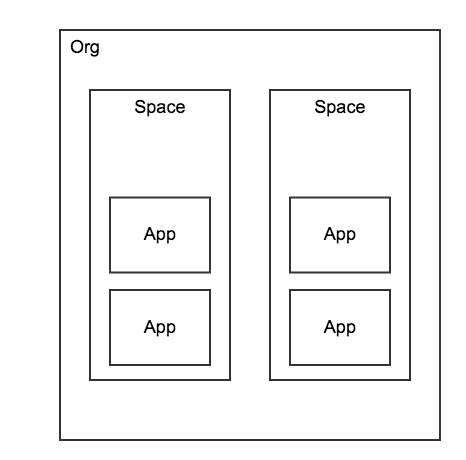
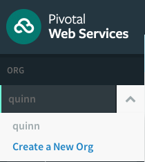
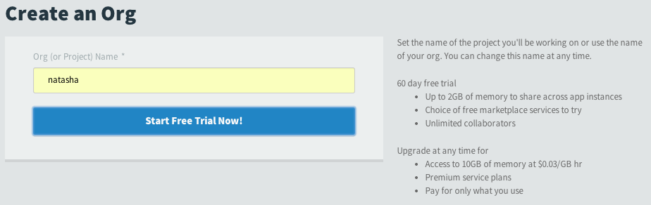
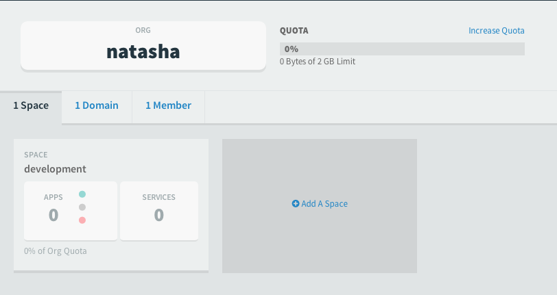

# Managing your applications: Orgs and Spaces



Although most of the exercises in this book are written with the assumption that you will be using a personal PWS trial account (or similar), most Cloud Foundry users are in a shared environment.

For example, let's say that you are a member of a medium to large scale group. In that case, your company may want to keep projects separate and ensure that all persons have the appropriate permissions assigned. This is accomplished by assigning users different org and space roles.

## What is an org?

An org is the top tier. Billing, quotas, custom domains, and user roles are managed at this level.

Although there are org management commands available in the CF CLI, with PWS org management tasks are done exclusively in the web UI.

### Org Roles

You can view the org roles by entering `cf set-org-role -h`. They are:

* **Org manager**: can invite and manage users, select and change plans, set spending limits.
* **Billing manager**: can create and manage the billing account and payment information.
* **Org auditor**: has read-only access to the org information and reports.

## Space: The Final Frontier

Each org can have one or more spaces associated with it. Similar to an org, there are separate roles that users can be assigned to determine what actions they can perform in the space. The space level controls custom routes, scoped resources, and application maintenance.

**Need to test**: Although there are org management commands available in the CF CLI, with PWS space management tasks are done exclusively in the web UI.

### Space Roles

You can view the space roles by entering `cf set-space-role -h`. They are:

* **Space manager**: can invite and manage users, and enable features for a given space.
* **Space developer**: can create and manage applications and services as well as view application logs and reports.
* **Space auditor**: has read only access to view logs, reports, and settings for a space.

## How do I manage my orgs and spaces?

Since PWS does not allow certain org and space management tasks to be done via the CLI, we are going to manage our users two ways: first we are going to use the CLI and TryCF and then we will use PWS's web UI.

### CLI exercises with AWS/TryCF

First, make sure you have logged in and targeted your instance:

```
$ cf login -a https://api.<IP address>.xip.io -u admin -p admin --skip-ssl-validation
```

#### Some basic org management

Now, let's take a look at what orgs are available:

```
$ cf orgs
Getting orgs as admin...

name
default
```

Similar to PWS, our new TryCF instance only has one org available. Let's create a couple more:

```
$ cf create-org natasha; cf create-org romanoff
Creating org natasha as admin...
OK

TIP: Use 'cf target -o natasha' to target new org

Creating org romanoff as admin...
OK

TIP: Use 'cf target -o romanoff' to target new org
```

Of course, `romanoff` should probably be `romanova` since `natasha` is a female name. So let's rename our org:

```
$ cf rename-org romanoff romanova
Renaming org romanoff to romanova as admin...
OK
```

Now let's take a look at the orgs in our account:

```
$ cf orgs
Getting orgs as admin...

name
default
natasha
romanova
```

Since we'll primarily be working in the `natasha` org, let's remove the third org:

```
$ cf delete-org romanova

Really delete the org romanova and everything associated with it?> y
Deleting org romanova as admin...
OK
```

#### Some basic space management

Recall that the CLI tool prompted us to target our new orgs immediately upon creation. Let's go ahead and target `natasha`:

```
$ cf target -o natasha

API endpoint:   https://api.54.173.26.223.xip.io (API version: 2.2.0)
User:           admin
Org:            natasha
Space:          No space targeted, use 'cf target -s SPACE'
```

`natasha` doesn't have any spaces yet, so the output simply indicates how to target a space. Let's create five spaces in this org:

```
$ cf spaces
Getting spaces in org natasha as admin...

name
No spaces found

$ cf create-space development; cf create-space testing; cf create-space staging; cf create-space production; cf create-space demo

Creating space development in org natasha as admin...
OK
Assigning role SpaceManager to user admin in org natasha / space development as admin...
OK
Assigning role SpaceDeveloper to user admin in org natasha / space development as admin...
OK

TIP: Use 'cf target -o natasha -s development' to target new space
Creating space testing in org natasha as admin...
OK
Assigning role SpaceManager to user admin in org natasha / space testing as admin...
OK
Assigning role SpaceDeveloper to user admin in org natasha / space testing as admin...
OK

TIP: Use 'cf target -o natasha -s testing' to target new space
Creating space staging in org natasha as admin...
OK
Assigning role SpaceManager to user admin in org natasha / space staging as admin...
OK
Assigning role SpaceDeveloper to user admin in org natasha / space staging as admin...
OK

TIP: Use 'cf target -o natasha -s staging' to target new space
Creating space production in org natasha as admin...
OK
Assigning role SpaceManager to user admin in org natasha / space production as admin...
OK
Assigning role SpaceDeveloper to user admin in org natasha / space production as admin...
OK

TIP: Use 'cf target -o natasha -s production' to target new space
Creating space demo in org natasha as admin...
OK
Assigning role SpaceManager to user admin in org natasha / space demo as admin...
OK
Assigning role SpaceDeveloper to user admin in org natasha / space demo as admin...
OK

TIP: Use 'cf target -o natasha -s demo' to target new space

$ cf spaces
Getting spaces in org natasha as admin...

name
development
testing
staging
production
demo
```

It turns out that we tend to push legacy applications to `demo` for some reason, so let's change that name to more accurately fit its use:

```
$ cf rename-space demo legacy
Renaming space demo to legacy in org natasha as admin...
OK

$ cf spaces
Getting spaces in org natasha as admin...

name
development
testing
staging
production
legacy
```

After a while, it turns out we don't need `legacy` (for now), so let's delete that space:

```
$ cf delete-space legacy

Really delete the space legacy?> y
Deleting space legacy in org natasha as admin...
OK
```

Now that we have some spaces associated with `natasha`, let's see what the org properties look like:

```
$ cf org natasha
Getting info for org natasha as admin...
OK

natasha:
  domains:  54.173.26.223.xip.io
  quota:    default (10240M memory limit, 1000 routes, 100 services, paid services allowed)
  spaces:   development, testing, staging, production
```

Even though we don't have any applications pushed yet, we can still see some properties associated with our spaces. Let's take a look at `development`:

```
$ cf space development
Getting info for space development in org natasha as admin...
OK

development:

   Org:               natasha
   Apps:
   Domains:           54.173.26.223.xip.io
   Services:
   Security Groups:
   Space Quota:
```

**Check it out: ** What happens if you...

* ...try to view the properties of one org while targeting another org? (e.g. If you try to view the properties of `default` while targeting `natasha`.)
* ...try to view the properties for the space `testing` while you are targeting a different org (e.g. `default`)?

### CLI and GUI exercises with PWS

#### Notice

Please be aware of the following:

* **Free trial accounts are limited to a single org.** If you attempt to add a second org, then you will be unable to delete the org until you enter either enter your credit card information or you can contact PWS support to delete the org for you. According to PWS support, you will not be charged if you enter your credit card information only to delete the org and the org remains empty of apps and/or spaces. The org will be inaccessible until you provide your credit card information.
  * There are no restrictions on the **number of spaces or apps** in an individual org. So free trial users can add any number spaces and apps to their account as long as the total resource usage remains below quota.
* **PWS does not allow all org and space management tasks to be done in via the CLI. ** Recall this book is based on the premise of error driven learning, so I will be working through the exercises below in the same sequence as above. Errors will be explained and used to show where actions are restricted to the GUI. In some cases the action cannot be performed by the user at all and a request must go through PWS.

If you are able to follow along with these exercises, please make sure you are logging into and targeting your PWS account:

```
$ cf login -a https://api.run.pivotal.io -u YOURUSERNAME -p YOURPASSWORD
```

#### Some basic org management

Let's try creating a second org via the CLI:

```
$ cf create-org natasha
Creating org natasha as qanx@starkandwayne.com...
FAILED
Server error, status code: 403, error code: 10003, message: You are not authorized to perform the requested action
```

Due to the way that PWS bills paid accoutns, orgs must be created in the GUI and have a unique name (across all PWS user accounts, not just your own). To create a new org in the GUI, do the following:

1. Click the down arrow next to your org name on the left nav bar:<br /> 
1. Click "Create New Org"
1. You will be prompted to enter your mobile phone number and verify your account
1. Click "Start Free Trial Now!" Note that with a paid account, you will get free two month trial with the org (see info to the right). <br />
1. You have successfully created your new org:<br />

Notice that, similar to when you created the first org in your free (or paid) PWS account, your new org is created with a single space named `development`.

If we head back over to the CLI, we can now see both orgs:

```
$ cf orgs
Getting orgs as qanx@starkandwayne.com...

name
quinn
natasha
```

We can target our new org:

```
$ cf target -o natasha

API endpoint:   https://api.run.pivotal.io (API version: 2.17.0)
User:           qanx@starkandwayne.com
Org:            natasha
Space:          No space targeted, use 'cf target -s SPACE'
```

Recall that when we logged in with `cf login` when there was only one org or a single space in the org, then it was targeted. At the time of this writing `cf target` doesn't have that ability. So we can either target our space as a separate command or we can target both the org and space at the same time:

```
$ cf target -s development

API endpoint:   https://api.run.pivotal.io (API version: 2.17.0)
User:           qanx@starkandwayne.com
Org:            natasha
Space:          development

$ cf target -o natasha -s development

API endpoint:   https://api.run.pivotal.io (API version: 2.17.0)
User:           qanx@starkandwayne.com
Org:            natasha
Space:          development
```

Orgs can be renamed from the CLI:

```
$ cf rename-org natasha tasha
Renaming org natasha to tasha as qanx@starkandwayne.com...
OK
```

As well as the GUI:

1. Find the org name near the top of the screen:<br />
1. Click anywhere in the org name field to enter the editor (the text at the top changes from "ORG" to "Rename" on mouseover):<br />
1. The name becomes an editable text field:<br />
1. Click elsewhere in the PWS screen and the name will update:<br />

#### Some basic space management

Similar to before, let's create some spaces. We already have `development`, so we'll just create the remaining four:

```
$ cf create-space testing; cf create-space staging; cf create-space production; cf create-space demo
Creating space testing in org tasha as qanx@starkandwayne.com...
OK
Assigning role SpaceManager to user qanx@starkandwayne.com in org tasha / space testing as qanx@starkandwayne.com...
OK
Assigning role SpaceDeveloper to user qanx@starkandwayne.com in org tasha / space testing as qanx@starkandwayne.com...
OK

TIP: Use 'cf target -o tasha -s testing' to target new space
Creating space staging in org tasha as qanx@starkandwayne.com...
OK
Assigning role SpaceManager to user qanx@starkandwayne.com in org tasha / space staging as qanx@starkandwayne.com...
OK
Assigning role SpaceDeveloper to user qanx@starkandwayne.com in org tasha / space staging as qanx@starkandwayne.com...
OK

TIP: Use 'cf target -o tasha -s staging' to target new space
Creating space production in org tasha as qanx@starkandwayne.com...
OK
Assigning role SpaceManager to user qanx@starkandwayne.com in org tasha / space production as qanx@starkandwayne.com...
OK
Assigning role SpaceDeveloper to user qanx@starkandwayne.com in org tasha / space production as qanx@starkandwayne.com...
OK

TIP: Use 'cf target -o tasha -s production' to target new space
Creating space demo in org tasha as qanx@starkandwayne.com...
OK
Assigning role SpaceManager to user qanx@starkandwayne.com in org tasha / space demo as qanx@starkandwayne.com...
OK
Assigning role SpaceDeveloper to user qanx@starkandwayne.com in org tasha / space demo as qanx@starkandwayne.com...
OK

TIP: Use 'cf target -o tasha -s demo' to target new space
```

We can list, rename, and delete spaces, just like with TryCF:

```
$ cf spaces
Getting spaces in org tasha as qanx@starkandwayne.com...

name
development
testing
staging
production
demo

$ cf rename-space demo legacy
Renaming space demo to legacy in org tasha as qanx@starkandwayne.com...
OK

$ cf spaces
Getting spaces in org tasha as qanx@starkandwayne.com...

name
development
testing
staging
production
legacy


$ cf delete-space legacy
Really delete the space legacy?> y
Deleting space legacy in org tasha as qanx@starkandwayne.com...
OK

$ cf spaces
Getting spaces in org tasha as qanx@starkandwayne.com...

name
development
testing
staging
production
```

**Check it out: ** How do you...

* ...rename a space in the PWS GUI?
* ...delete a space in the PWS GUI?

Although we can still view org and space properties the same as before, there will be some differences between the orgs and spaces of the free account, paid account, and the new second org on the paid account.

** Paid account: ** org `tasha`, space `development`

```
$ cf org tasha
Getting info for org tasha as qanx@starkandwayne.com...
OK

tasha:
  domains:  cfapps.io
  quota:    trial (2048M memory limit, 1000 routes, 10 services, paid services disallowed)
  spaces:   development, production, staging, testing

$ cf space development
Getting info for space development in org tasha as qanx@starkandwayne.com...
OK

development:

   Org:               tasha
   Apps:
   Domains:           cfapps.io
   Services:
   Security Groups:   public_networks, dns
   Space Quota:
```

** Paid account: ** org `drnic-starkandwayne`, space `trycf`

```
$ cf org drnic-starkandwayne
Getting info for org drnic-starkandwayne as qanx@starkandwayne.com...
OK

drnic-starkandwayne:
  domains:  starkandwayne.com, cfapps.io
  quota:    paid (10240M memory limit, 1000 routes, -1 services, paid services allowed)
  spaces:   broker, demo, development, production, training, training-preview, trycf

$ cf space trycf
Getting info for space trycf in org drnic-starkandwayne as qanx@starkandwayne.com...
OK

trycf:

   Org:               drnic-starkandwayne
   Apps:              trycf, trycf-dashboard
   Domains:           starkandwayne.com, cfapps.io
   Services:          trycf-es, trycf-redis
   Security Groups:   public_networks, dns
   Space Quota:
```

** Free trial account: ** org `quinn`, space `development`

```
$ cf org quinn
Getting info for org quinn as quinn@thecodingmant.is...
OK

quinn:
  domains:  cfapps.io
  quota:    trial (2048M memory limit, 1000 routes, 10 services, paid services disallowed)
  spaces:   development

$ cf space development
Getting info for space development in org quinn as quinn@thecodingmant.is...
OK

development:

   Org:               quinn
   Apps:              cf-env-qanx
   Domains:           cfapps.io
   Services:
   Security Groups:   public_networks, dns
   Space Quota:
```

You can see that there are some differences between the PWS orgs and spaces and those in AWS (TryCF). Aside from different domains, we can see that the quotas are different between the orgs:

* Both the TryCF/AWS instance and the established paid org have the highest memory quota at 10 GB, whereas the trial account and new (trial) org have 2 GB.
* Although all orgs have the same number of routes, but the number of services varies between orgs. The established paid org allows an unlimited number of services (displayed as `-1 services`), the TryCF/AWS instance allows 100 services, and both the free trial account and new trial org are limited to 10 services.
* The TryCF/AWS instance and the established paid org support paid services, the trial account and new (trial) org do not.
* Both the spaces `quinn`.`development` and `drnic-starkandwayne`.`trycf` have apps, but only `trycf` has bound services, which happen to be Redis and Elasticsearch.

We will be discussing what these various topics are in greater depth in subsequent chapters.

#### CF CLI Commands

A quick review of the commands covered in this section:

| Command | Usage |
|----------|--------|
| `cf orgs` | View all orgs associated with an account |
| `cf org` | View details about a specific org |
| `cf create-org` | Create an org |
| `cf rename-org` | Rename an org |
| `cf delete-org` | Delete an org |
| `cf spaces` | View all spaces in the targeted org |
| `cf space` | View details about a specific space |
| `cf create-space` | Create a space in an org (targeted org is default) |
| `cf rename-space` | Rename a space |
| `cf delete-space` | Delete a space |
| `cf target` | Targets a specific org or space |
